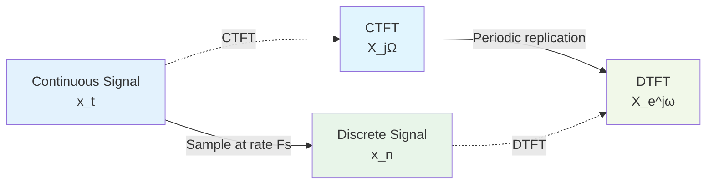
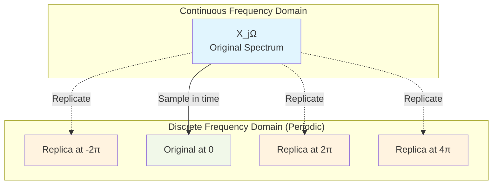
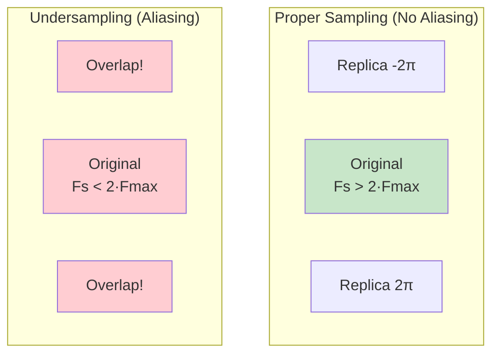
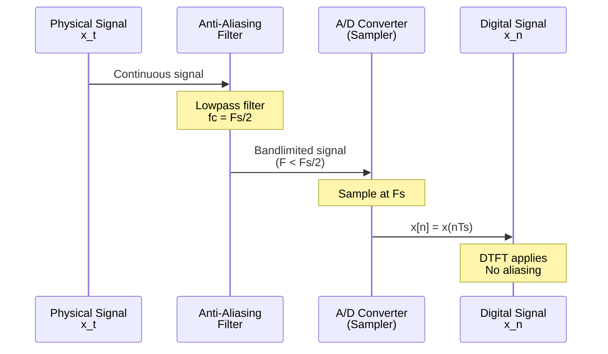

# Module 3: DTFT and Sampling

## Introduction

The **Discrete-Time Fourier Transform (DTFT)** is the frequency-domain representation of discrete aperiodic signals. Understanding the DTFT is crucial for grasping how sampling affects signals and how aliasing occurs.

## Discrete-Time Fourier Transform (DTFT)

### Definition

For a discrete-time signal $x[n]$ that is **aperiodic** (or absolutely summable), the DTFT is:

**Analysis Equation (Time → Frequency):**

$$X(e^{j\omega}) = \sum_{n=-\infty}^{\infty} x[n]e^{-j\omega n}$$

**Synthesis Equation (Frequency → Time):**

$$x[n] = \frac{1}{2\pi} \int_{2\pi} X(e^{j\omega})e^{j\omega n} \, d\omega$$

where $\omega$ is the normalized angular frequency in radians/sample.

### Key Properties

**1. Periodicity in Frequency**

$$X(e^{j\omega}) = X(e^{j(\omega + 2\pi k)}) \quad \text{for any integer } k$$

The DTFT is **always periodic** with period $2\pi$. This is a fundamental consequence of sampling.

**2. Frequency Range**

Because of periodicity, we only need to consider:
- $\omega \in [0, 2\pi]$ or
- $\omega \in [-\pi, \pi]$ (most common)

**3. Nyquist Frequency**

The highest meaningful frequency is $\omega = \pi$ (or $f = 0.5$), known as the **Nyquist frequency**.

## Sampling: From Continuous to Discrete

### The Sampling Process

### Sampling Relationship

When we sample a continuous signal $x(t)$ at sampling period $T_s = 1/F_s$:

$$x[n] = x(nT_s)$$

The relationship between frequency variables is:

$$\omega = \Omega T_s = \frac{\Omega}{F_s}$$

or equivalently:

$$f = \frac{F}{F_s}$$

where:
- $\Omega$ = continuous angular frequency (rad/s)
- $F$ = continuous frequency (Hz)
- $\omega$ = discrete angular frequency (rad/sample)
- $f$ = discrete normalized frequency (cycles/sample)
- $F_s$ = sampling rate (samples/second)
- $T_s$ = sampling period (seconds/sample)

### DTFT in Terms of CTFT

The DTFT is related to the CTFT by:

$$X(e^{j\omega}) = \frac{1}{T_s} \sum_{k=-\infty}^{\infty} X\left(j\frac{\omega - 2\pi k}{T_s}\right)$$

This equation shows that the DTFT is a **periodic replication** of the scaled CTFT.

## Aliasing

### What is Aliasing?

**Aliasing** occurs when the periodic replicas of the spectrum **overlap**, causing high-frequency components to appear as low-frequency components.

### Aliasing Demonstration

### The Nyquist-Shannon Sampling Theorem

**Statement:** A continuous signal $x(t)$ with bandwidth limited to $F_{\max}$ can be perfectly reconstructed from its samples if:

$$F_s \geq 2F_{\max}$$

or equivalently:

$$\Omega_s \geq 2\Omega_{\max}$$

where:
- $F_s$ is the sampling frequency
- $F_{\max}$ is the maximum frequency in the signal
- $F_N = F_s/2$ is the **Nyquist frequency**

**In normalized frequency:**

The signal must be bandlimited to $f < 0.5$ (or $\omega < \pi$).

### Consequences of Aliasing

1. **Information loss**: Cannot distinguish between frequencies that differ by multiples of $2\pi$
2. **Distortion**: High frequencies appear as low frequencies
3. **Irreversibility**: Cannot recover original signal from aliased samples

**Example:**

Sampling a 60 Hz signal at 80 Hz (Fs = 80 Hz):
- Normalized frequency: $f = 60/80 = 0.75$ cycles/sample
- Nyquist frequency: $f_N = 0.5$ cycles/sample
- Signal is **undersampled** (aliasing occurs)
- Appears as: $f_{alias} = 1 - 0.75 = 0.25$ (20 Hz when converted back)

## DTFT Properties

### 1. Linearity

$$a x_1[n] + b x_2[n] \xrightarrow{\text{DTFT}} a X_1(e^{j\omega}) + b X_2(e^{j\omega})$$

### 2. Time Shifting

$$x[n - n_0] \xrightarrow{\text{DTFT}} e^{-j\omega n_0} X(e^{j\omega})$$

**Interpretation:** Time delay introduces linear phase shift in frequency domain.

### 3. Frequency Shifting (Modulation)

$$e^{j\omega_0 n} x[n] \xrightarrow{\text{DTFT}} X(e^{j(\omega - \omega_0)})$$

### 4. Convolution Theorem

**Time domain convolution ↔ Frequency domain multiplication:**

$$y[n] = x[n] * h[n] \xrightarrow{\text{DTFT}} Y(e^{j\omega}) = X(e^{j\omega}) \cdot H(e^{j\omega})$$

This is the foundation of frequency-domain filtering!

### 5. Multiplication Theorem

**Time domain multiplication ↔ Frequency domain convolution:**

$$x[n] \cdot h[n] \xrightarrow{\text{DTFT}} \frac{1}{2\pi} X(e^{j\omega}) \circledast H(e^{j\omega})$$

### 6. Parseval's Theorem (Energy Conservation)

$$\sum_{n=-\infty}^{\infty} |x[n]|^2 = \frac{1}{2\pi} \int_{2\pi} |X(e^{j\omega})|^2 \, d\omega$$

Energy in time domain equals energy in frequency domain.

### 7. Symmetry for Real Signals

If $x[n]$ is real:

$$X(e^{-j\omega}) = X^*(e^{j\omega})$$

**Consequences:**
- $|X(e^{j\omega})|$ is even (magnitude spectrum is symmetric)
- $\angle X(e^{j\omega})$ is odd (phase spectrum is antisymmetric)

## Common DTFT Pairs

| Signal $x[n]$ | DTFT $X(e^{j\omega})$ |
|---------------|----------------------|
| $\delta[n]$ | $1$ |
| $\delta[n - n_0]$ | $e^{-j\omega n_0}$ |
| $u[n]$ | $\frac{1}{1 - e^{-j\omega}} + \pi\sum_{k=-\infty}^{\infty}\delta(\omega - 2\pi k)$ |
| $a^n u[n]$, $\|a\| < 1$ | $\frac{1}{1 - ae^{-j\omega}}$ |
| $\cos(\omega_0 n)$ | $\pi\sum_{k=-\infty}^{\infty}[\delta(\omega - \omega_0 - 2\pi k) + \delta(\omega + \omega_0 - 2\pi k)]$ |

## Practical Sampling Workflow

**Steps:**

1. **Anti-aliasing filter**: Lowpass filter to remove frequencies above $F_s/2$
2. **Sampling**: Convert to discrete-time at rate $F_s$
3. **Processing**: Apply DTFT, filters, analysis
4. **(Optional) Reconstruction**: D/A conversion to continuous signal

## Frequency Response of Systems

For an LTI system with impulse response $h[n]$, the **frequency response** is:

$$H(e^{j\omega}) = \sum_{n=-\infty}^{\infty} h[n]e^{-j\omega n}$$

**Interpretation:**

- $|H(e^{j\omega})|$ = magnitude response (gain at each frequency)
- $\angle H(e^{j\omega})$ = phase response (phase shift at each frequency)

**Output in frequency domain:**

$$Y(e^{j\omega}) = X(e^{j\omega}) \cdot H(e^{j\omega})$$

## Next Steps

In Module 4, we'll explore the **DFT (Discrete Fourier Transform)**, which is the computationally realizable version of the DTFT. The DFT samples the DTFT at discrete frequency points, making it suitable for numerical computation via the FFT algorithm.

## Exercises

1. Compute the DTFT of $x[n] = a^n u[n]$ and plot its magnitude and phase
2. Demonstrate aliasing by sampling a high-frequency sinusoid at different rates
3. Verify the convolution theorem using DTFT
4. Design an anti-aliasing filter and test it on a signal with multiple frequency components
5. Explore the relationship between $\omega$ and $\Omega$ for different sampling rates

See `dtft.py` and `dtft_sampling.ipynb` for implementations and interactive examples.
