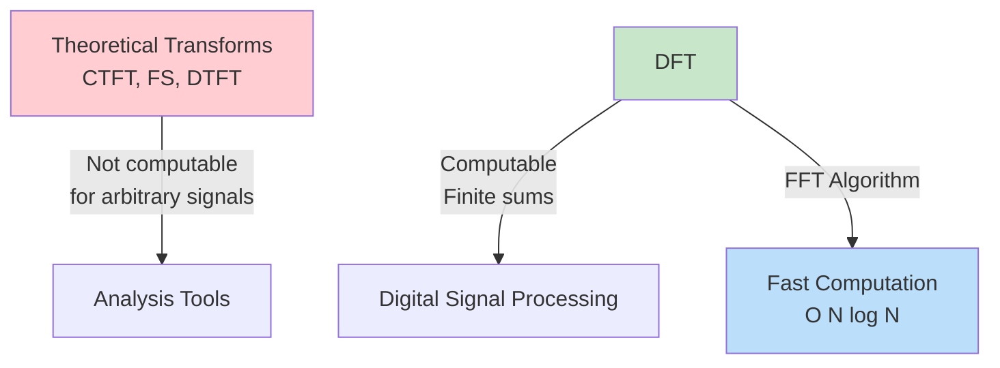
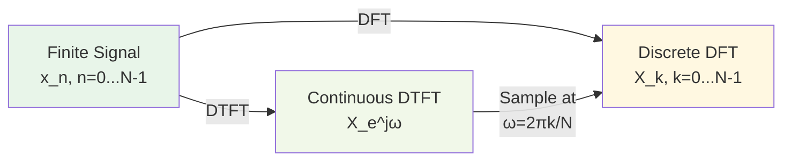
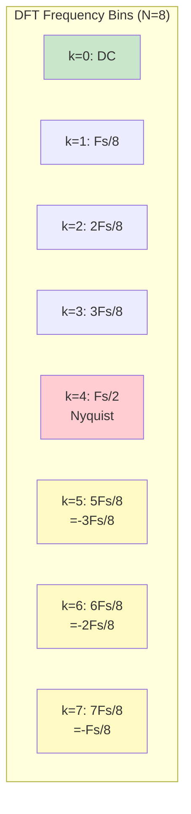
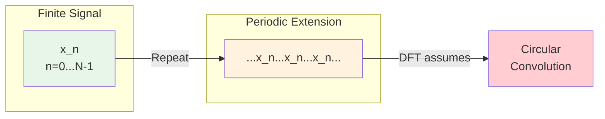
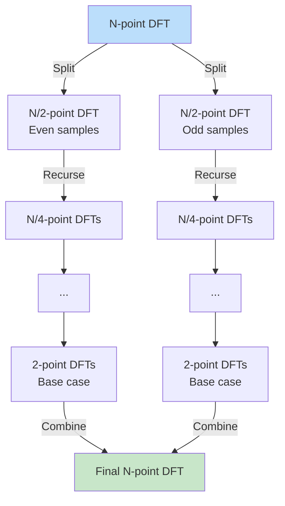
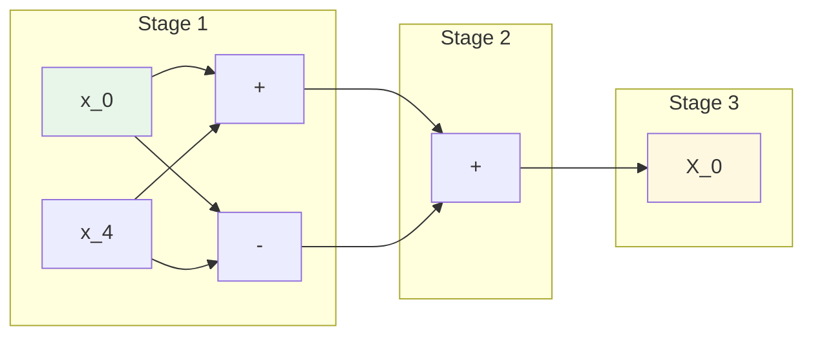
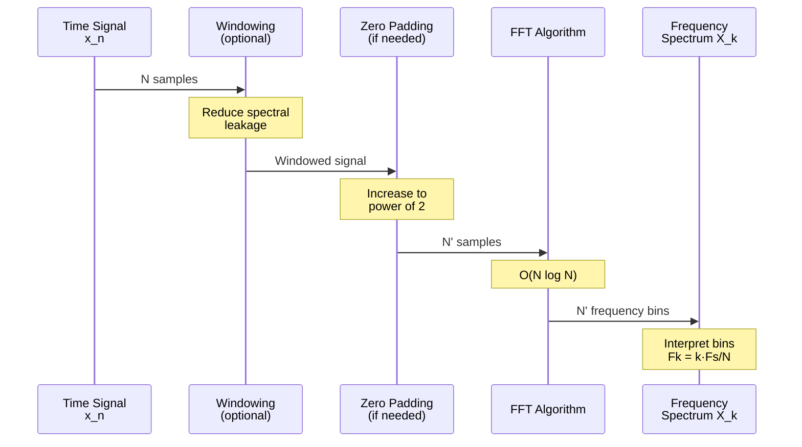

# Module 4: DFT and FFT

## Introduction

The **Discrete Fourier Transform (DFT)** is the only Fourier transform that is **computationally realizable**. It represents finite-length sequences in the frequency domain using a finite number of frequency samples. The **Fast Fourier Transform (FFT)** is an efficient algorithm for computing the DFT.

## Why DFT?

The transforms we've seen so far:
- **CTFT**: Requires integration (analytical)
- **FS**: Requires integration (analytical)
- **DTFT**: Requires infinite summation (analytical)
- **DFT**: Uses **finite summation** → Can be computed!

## Discrete Fourier Series (DFS)

### For Periodic Sequences

For a **periodic** discrete sequence $\tilde{x}[n]$ with period $N$:

$$\tilde{x}[n] = \tilde{x}[n + N] \quad \text{for all } n$$

**Analysis Equation:**

$$\tilde{X}[k] = \sum_{n=\langle N \rangle} \tilde{x}[n]e^{-j(2\pi/N)kn}$$

**Synthesis Equation:**

$$\tilde{x}[n] = \frac{1}{N} \sum_{k=\langle N \rangle} \tilde{X}[k]e^{j(2\pi/N)kn}$$

where $\langle N \rangle$ denotes summation over any $N$ consecutive values.

**Note:** Both $\tilde{x}[n]$ and $\tilde{X}[k]$ are periodic with period $N$.

## Discrete Fourier Transform (DFT)

### For Finite-Length Sequences

For a **finite-length** sequence $x[n]$, $n = 0, 1, \ldots, N-1$:

**Analysis Equation (Time → Frequency):**

$$X[k] = \sum_{n=0}^{N-1} x[n]e^{-j(2\pi/N)kn}, \quad k = 0, 1, \ldots, N-1$$

**Synthesis Equation (Frequency → Time):**

$$x[n] = \frac{1}{N} \sum_{k=0}^{N-1} X[k]e^{j(2\pi/N)kn}, \quad n = 0, 1, \ldots, N-1$$

**Compact Notation:**

Define the **twiddle factor**:

$$W_N = e^{-j2\pi/N}$$

Then:

$$X[k] = \sum_{n=0}^{N-1} x[n]W_N^{kn}$$

$$x[n] = \frac{1}{N} \sum_{k=0}^{N-1} X[k]W_N^{-kn}$$

### Properties

**1. Both sequences have length $N$**
- Input: $x[n]$, $n = 0, 1, \ldots, N-1$
- Output: $X[k]$, $k = 0, 1, \ldots, N-1$

**2. Periodic interpretation**
The DFT can be viewed as **one period** of the DFS.

**3. Computational complexity**
- Direct computation: $O(N^2)$ operations
- FFT algorithm: $O(N \log N)$ operations

## Relationship: DTFT ↔ DFT

The DFT **samples the DTFT** at $N$ equally-spaced points around the unit circle:

$$X[k] = X(e^{j\omega})\bigg|_{\omega = \frac{2\pi k}{N}}, \quad k = 0, 1, \ldots, N-1$$

**Interpretation:**

The DFT provides $N$ samples of the DTFT at frequencies:

$$\omega_k = \frac{2\pi k}{N}, \quad k = 0, 1, \ldots, N-1$$

### Inverse Relationship: DFT → DTFT

The DTFT can be reconstructed from the DFT:

$$X(e^{j\omega}) = \sum_{k=0}^{N-1} X[k] \cdot \text{interpolation kernel}$$

This is called **frequency domain interpolation**.

## Frequency Bins and Resolution

### Frequency Mapping

For an $N$-point DFT with sampling frequency $F_s$:

**Discrete-time frequency (radians/sample):**

$$\omega_k = \frac{2\pi k}{N}, \quad k = 0, 1, \ldots, N-1$$

**Analog frequency (Hz):**

$$F_k = \frac{k F_s}{N} = \frac{k}{NT_s}$$

where $T_s = 1/F_s$ is the sampling period.

### Important Frequency Bins

| Bin Index | Frequency | Description |
|-----------|-----------|-------------|
| $k = 0$ | $F = 0$ | **DC component** (average value) |
| $k = 1$ | $F = F_s/N$ | **Fundamental frequency** (lowest non-zero) |
| $k = N/2$ | $F = F_s/2$ | **Nyquist frequency** (if $N$ even) |
| $k = N-1$ | $F = F_s(N-1)/N$ | Highest bin (wraps to negative freq) |

### Frequency Resolution

The **frequency resolution** is the spacing between bins:

$$\Delta F = \frac{F_s}{N} = \frac{1}{NT_s}$$

**Key insight:** To improve frequency resolution, increase $N$ (longer signal or zero-padding).

### Frequency Interpretation

**Note:** For $k > N/2$, frequencies represent **negative frequencies** due to periodicity:

$$F_k = F_{N-k} \quad \text{(for real signals)}$$

## Circular Convolution

### Linear vs Circular Convolution

**Linear convolution** (time domain):

$$y[n] = x[n] * h[n] = \sum_{m=-\infty}^{\infty} x[m]h[n-m]$$

**Circular convolution** (DFT domain):

$$y[n] = x[n] \circledast h[n] = \sum_{m=0}^{N-1} x[m]h[(n-m) \mod N]$$

### Why Circular?

The DFT assumes **periodic extension** of finite sequences:

$$\tilde{x}[n] = \sum_{r=-\infty}^{\infty} x[n - rN]$$

### DFT Convolution Property

**Circular convolution in time ↔ Multiplication in frequency:**

$$x[n] \circledast h[n] \xrightarrow{\text{DFT}} X[k] \cdot H[k]$$

**This is NOT the same as linear convolution!**

### Getting Linear Convolution from DFT

To get linear convolution using DFT:

1. **Zero-pad** both sequences to length $L \geq N_x + N_h - 1$
2. Compute $L$-point DFT of both
3. Multiply: $Y[k] = X[k] \cdot H[k]$
4. Compute inverse DFT: $y[n] = \text{IDFT}\{Y[k]\}$

Result: $y[n]$ equals linear convolution (no circular wrap-around).

## Fast Fourier Transform (FFT)

### The Problem

Direct DFT computation requires $N^2$ complex multiplications:

$$X[k] = \sum_{n=0}^{N-1} x[n]e^{-j2\pi kn/N}$$

For $N = 1024$: ~1 million operations
For $N = 1,000,000$: ~$10^{12}$ operations (infeasible!)

### The Solution: FFT

The **Cooley-Tukey FFT algorithm** exploits symmetry and periodicity of $W_N$ to reduce complexity:

- **Direct DFT**: $O(N^2)$
- **FFT**: $O(N \log N)$

For $N = 1024$:
- DFT: ~1,000,000 operations
- FFT: ~10,000 operations (**100× faster!**)

### FFT Algorithm (Radix-2, Decimation-in-Time)

**Requirements:** $N = 2^r$ (power of 2)

**Idea:** Divide and conquer

1. **Split** $x[n]$ into even and odd indices:
   - $x_{\text{even}}[n] = x[2n]$
   - $x_{\text{odd}}[n] = x[2n+1]$

2. **Compute** $N/2$-point DFTs of each:
   - $X_{\text{even}}[k]$ and $X_{\text{odd}}[k]$

3. **Combine** using butterfly operation:
   $$X[k] = X_{\text{even}}[k] + W_N^k X_{\text{odd}}[k]$$
   $$X[k + N/2] = X_{\text{even}}[k] - W_N^k X_{\text{odd}}[k]$$

4. **Recurse** until reaching 2-point DFTs

### FFT Butterfly Diagram

For $N=8$ FFT:

Each "butterfly" combines two values using addition and twiddle factor multiplication.

### FFT Complexity Analysis

**Number of stages:** $\log_2 N$
**Operations per stage:** $N$
**Total:** $N \log_2 N$

| $N$ | DFT Operations | FFT Operations | Speedup |
|-----|----------------|----------------|---------|
| 16 | 256 | 64 | 4× |
| 64 | 4,096 | 384 | 11× |
| 256 | 65,536 | 2,048 | 32× |
| 1,024 | 1,048,576 | 10,240 | 102× |
| 4,096 | 16,777,216 | 49,152 | 341× |

**Revolutionary impact:** Made real-time digital signal processing possible!

## DFT Properties

### 1. Linearity

$$ax_1[n] + bx_2[n] \xrightarrow{\text{DFT}} aX_1[k] + bX_2[k]$$

### 2. Circular Time Shift

$$x[(n - n_0) \mod N] \xrightarrow{\text{DFT}} W_N^{kn_0} X[k]$$

### 3. Circular Frequency Shift

$$W_N^{-k_0 n} x[n] \xrightarrow{\text{DFT}} X[(k - k_0) \mod N]$$

### 4. Symmetry (Real Signals)

For real $x[n]$:

$$X[k] = X^*[N-k]$$

**Consequences:**
- $X[0]$ is real (DC)
- $X[N/2]$ is real (Nyquist, if $N$ even)
- Only need to compute $k = 0, 1, \ldots, N/2$

### 5. Parseval's Theorem

$$\sum_{n=0}^{N-1} |x[n]|^2 = \frac{1}{N} \sum_{k=0}^{N-1} |X[k]|^2$$

### 6. Convolution (Circular)

$$x[n] \circledast h[n] \xrightarrow{\text{DFT}} X[k] \cdot H[k]$$

### 7. Multiplication

$$x[n] \cdot h[n] \xrightarrow{\text{DFT}} \frac{1}{N} X[k] \circledast H[k]$$

## Practical DFT/FFT Usage

### Signal Analysis Workflow

### Best Practices

1. **Choose $N$ as power of 2** for FFT efficiency
2. **Apply window function** to reduce spectral leakage (Module 6)
3. **Zero-pad** if necessary for:
   - Power-of-2 length
   - Finer frequency resolution
   - Linear convolution via FFT

4. **Interpret frequency bins correctly**:
   - Bins $0$ to $N/2$: positive frequencies
   - Bins $N/2+1$ to $N-1$: negative frequencies

## Next Steps

In Module 5, we'll apply DFT/FFT to **frequency domain filtering**, using the convolution theorem to implement efficient filters in the frequency domain.

## Exercises

1. Compute the DFT of $x[n] = [1, 2, 3, 4]$ by hand
2. Implement radix-2 FFT from scratch
3. Compare direct DFT vs FFT computation times for various $N$
4. Demonstrate circular vs linear convolution
5. Use zero-padding to perform linear convolution via FFT
6. Analyze the frequency spectrum of a composite signal

See `dft_fft.py` and `dft_fft.ipynb` for implementations.
