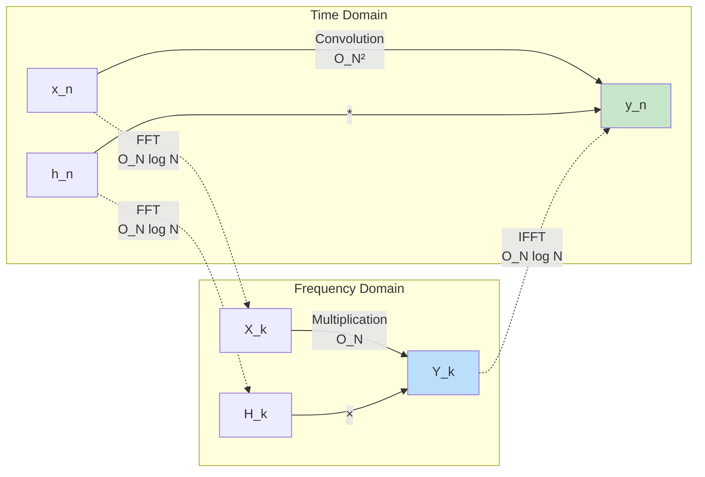
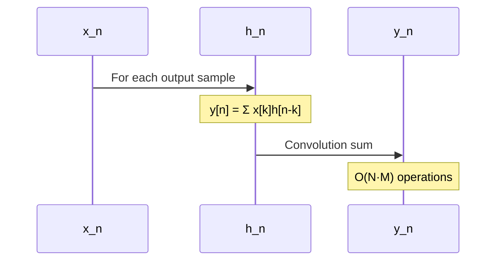
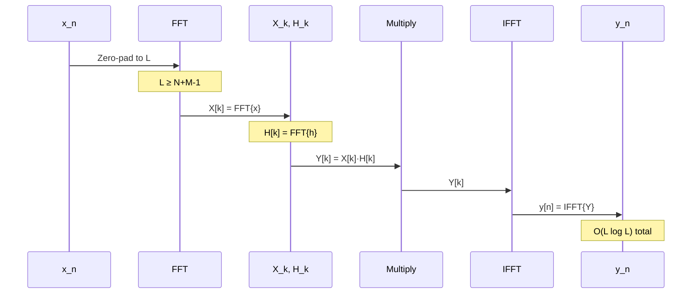
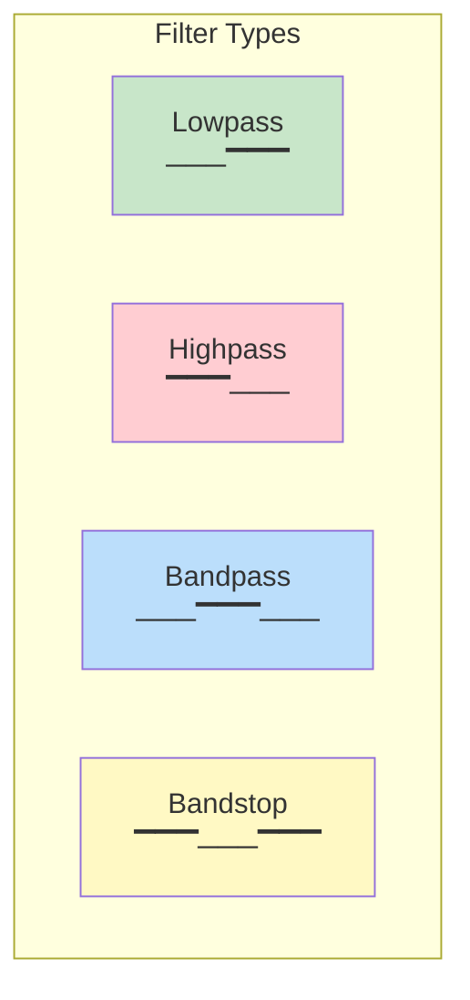
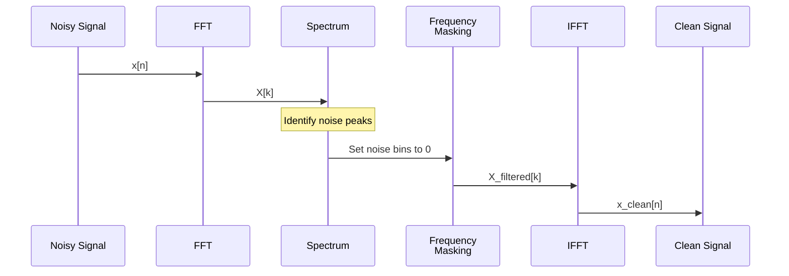
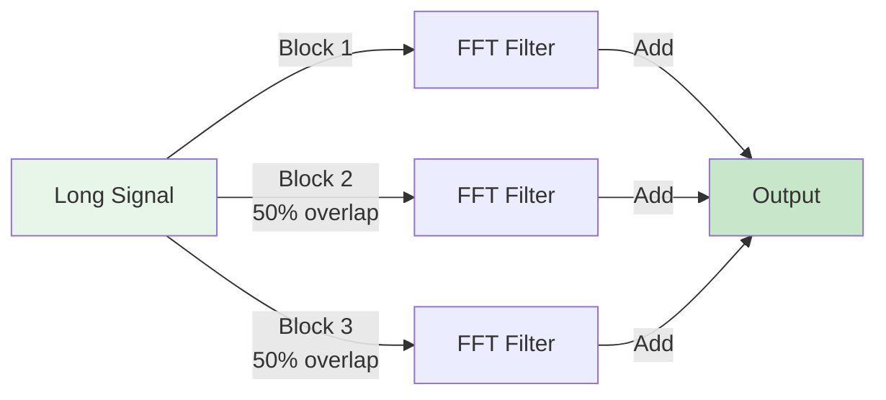

# Module 5: Frequency Domain Filtering

## Introduction

**Frequency domain filtering** leverages the convolution theorem to implement filters efficiently. Instead of computing convolution directly in the time domain, we can multiply in the frequency domain and use the FFT for fast computation.

## The Convolution Theorem

### Time Domain ↔ Frequency Domain

**For DTFT:**

$$y[n] = x[n] * h[n] \quad \xleftrightarrow{\text{DTFT}} \quad Y(e^{j\omega}) = X(e^{j\omega}) \cdot H(e^{j\omega})$$

**For DFT (circular convolution):**

$$y[n] = x[n] \circledast h[n] \quad \xleftrightarrow{\text{DFT}} \quad Y[k] = X[k] \cdot H[k]$$



**Key Insight:** For long signals, frequency domain filtering is faster!

### Computational Complexity Comparison

| Method | Complexity | Best For |
|--------|-----------|----------|
| **Direct Convolution** | $O(N \cdot M)$ | Short filters ($M \ll N$) |
| **FFT-based** | $O(N \log N)$ | Long filters ($M$ comparable to $N$) |

**Crossover point:** Typically when $M > 50-100$ samples.

## Filtering Workflow

### Time Domain Filtering



### Frequency Domain Filtering



## Frequency Response and Filter Types

### Frequency Response

For an LTI system with impulse response $h[n]$:

$$H(e^{j\omega}) = \sum_{n=-\infty}^{\infty} h[n]e^{-j\omega n}$$

**Components:**

- **Magnitude response**: $|H(e^{j\omega})|$ - gain at each frequency
- **Phase response**: $\angle H(e^{j\omega})$ - phase shift at each frequency

**Output spectrum:**

$$Y(e^{j\omega}) = X(e^{j\omega}) \cdot H(e^{j\omega})$$

```mermaid
graph TD
    subgraph "Filter Characteristics"
        A[Magnitude Response<br/>|H_e^jω|] -->|Determines| B[Which frequencies<br/>pass/attenuate]
        C[Phase Response<br/>∠H_e^jω] -->|Determines| D[Time delay and<br/>phase distortion]
    end

    style A fill:#e1f5fe
    style C fill:#f3e5f5
```

### Ideal Filter Types

#### 1. Ideal Lowpass Filter

**Frequency Response:**

$$H_{\text{LP}}(e^{j\omega}) = \begin{cases}
1 & |\omega| \leq \omega_c \\
0 & \omega_c < |\omega| \leq \pi
\end{cases}$$

where $\omega_c$ is the **cutoff frequency**.

**Characteristics:**
- Passes low frequencies ($|\omega| < \omega_c$)
- Blocks high frequencies ($|\omega| > \omega_c$)
- Sharp transition (brick wall)

**Problem:** Not realizable in practice (infinite impulse response)

#### 2. Ideal Highpass Filter

**Frequency Response:**

$$H_{\text{HP}}(e^{j\omega}) = \begin{cases}
0 & |\omega| \leq \omega_c \\
1 & \omega_c < |\omega| \leq \pi
\end{cases}$$

**Characteristics:**
- Blocks low frequencies
- Passes high frequencies
- Useful for edge detection

#### 3. Ideal Bandpass Filter

**Frequency Response:**

$$H_{\text{BP}}(e^{j\omega}) = \begin{cases}
1 & \omega_{c1} \leq |\omega| \leq \omega_{c2} \\
0 & \text{otherwise}
\end{cases}$$

**Characteristics:**
- Passes frequencies in $[\omega_{c1}, \omega_{c2}]$
- Blocks all others
- Useful for isolating specific frequency bands

#### 4. Ideal Bandstop (Notch) Filter

**Frequency Response:**

$$H_{\text{BS}}(e^{j\omega}) = \begin{cases}
0 & \omega_{c1} \leq |\omega| \leq \omega_{c2} \\
1 & \text{otherwise}
\end{cases}$$

**Characteristics:**
- Blocks specific frequency band
- Passes all others
- Useful for removing interference (e.g., 60 Hz power line noise)

### Filter Comparison



## Practical Filter Design

### Real-World Constraints

Ideal filters are **not realizable** because:

1. **Infinite impulse response** (non-causal)
2. **Sharp transitions** require infinite filter length
3. **Linear phase** difficult to achieve

**Solution:** Design **approximate** filters with acceptable specifications.

### Filter Specifications

```mermaid
graph TD
    subgraph "Lowpass Filter Specifications"
        A[Passband<br/>0 to ωp] -->|Ripple δ1| B[Transition Band<br/>ωp to ωs]
        B --> C[Stopband<br/>ωs to π]

        D[|H|] -.->|1+δ1| A
        D -.->|1-δ1| A
        D -.->|δ2| C
    end

    style A fill:#c8e6c9
    style B fill:#fff9c4
    style C fill:#ffcdd2
```

**Parameters:**

- $\omega_p$ = **passband edge** (frequencies we want to keep)
- $\omega_s$ = **stopband edge** (frequencies we want to remove)
- $\delta_1$ = **passband ripple** (tolerable variation in passband)
- $\delta_2$ = **stopband attenuation** (how much to attenuate stopband)
- Transition band = $\omega_s - \omega_p$ (wider → easier to implement)

### Window Method

**Idea:** Truncate ideal (infinite) impulse response with a window function.

**Steps:**

1. Design ideal filter $H_{\text{ideal}}(e^{j\omega})$
2. Compute inverse DTFT to get $h_{\text{ideal}}[n]$
3. Apply window $w[n]$: $h[n] = h_{\text{ideal}}[n] \cdot w[n]$
4. Use $h[n]$ as FIR filter

**Example - Ideal Lowpass:**

$$h_{\text{ideal}}[n] = \frac{\sin(\omega_c n)}{\pi n}$$

Truncate and window:

$$h[n] = h_{\text{ideal}}[n] \cdot w[n], \quad n = 0, 1, \ldots, M-1$$

(Window functions covered in Module 6)

### Frequency Sampling Method

**Idea:** Design filter by specifying desired frequency response at DFT frequencies.

**Steps:**

1. Specify $H[k]$ for $k = 0, 1, \ldots, N-1$
2. Compute $h[n] = \text{IDFT}\{H[k]\}$
3. Use $h[n]$ as filter

**Advantage:** Direct control over frequency response
**Disadvantage:** Only at DFT frequencies

## Spectral Analysis

### Power Spectral Density (PSD)

**Periodogram:**

$$P(e^{j\omega}) = \frac{1}{N} |X(e^{j\omega})|^2$$

For DFT:

$$P[k] = \frac{1}{N} |X[k]|^2$$

**Interpretation:** Power (energy) at each frequency.

### Applications

#### 1. Noise Removal

Identify and remove noise at specific frequencies:



#### 2. Signal Enhancement

Amplify specific frequency bands:

$$Y[k] = X[k] \cdot G[k]$$

where $G[k]$ is a gain function.

#### 3. System Identification

Given input $x[n]$ and output $y[n]$, estimate system:

$$H[k] = \frac{Y[k]}{X[k]}$$

## When to Use Frequency Domain Filtering

### Use Frequency Domain When:

✅ Filter is long (many coefficients)
✅ Processing large blocks of data
✅ Need to design filter by frequency specifications
✅ Performing spectral analysis simultaneously
✅ Implementing frequency-selective operations

### Use Time Domain When:

✅ Filter is short (few coefficients)
✅ Real-time processing with low latency required
✅ Processing streaming data
✅ Simple filters (moving average, differentiator)

### Comparison Table

| Criterion | Time Domain | Frequency Domain |
|-----------|-------------|------------------|
| **Latency** | Low (sample-by-sample) | High (block processing) |
| **Efficiency** | Good for short filters | Good for long filters |
| **Memory** | Low | High (FFT buffers) |
| **Flexibility** | Fixed filter | Easy to modify $H[k]$ |
| **Real-time** | Excellent | Limited |

## Practical Considerations

### 1. Overlap-Add Method

For long signals, process in blocks with overlap:



**Advantages:**
- Process arbitrarily long signals
- Maintain FFT efficiency
- Avoid circular convolution artifacts

### 2. Overlap-Save Method

Alternative block processing:

1. Save last $M-1$ samples from previous block
2. Prepend to next block
3. Compute circular convolution via FFT
4. Discard first $M-1$ output samples

### 3. Zero-Phase Filtering

For applications requiring no phase distortion:

$$y[n] = h[n] * (h[-n] * x[n])$$

Filter forward, then backward.

## Examples

### Example 1: Removing High-Frequency Noise

**Signal:** Clean signal + high-frequency noise

**Approach:**
1. Compute FFT
2. Set high-frequency bins to zero
3. Compute IFFT

### Example 2: Isolating Heart Rate

**Signal:** ECG with multiple frequency components

**Approach:**
1. Design bandpass filter (0.5-3 Hz for heart rate)
2. Apply via frequency domain multiplication
3. Identify peaks in filtered signal

### Example 3: Audio Equalization

**Signal:** Audio recording

**Approach:**
1. Compute FFT
2. Apply gain curve $G[k]$ (boost/cut bands)
3. Compute IFFT

## Next Steps

In Module 6, we'll explore **windowing** and **spectral leakage**, learning how to minimize artifacts when analyzing finite-length signals and designing better filters.

## Exercises

1. Design a lowpass filter and compare time vs frequency domain implementation
2. Remove 60 Hz noise from a signal using frequency domain filtering
3. Implement overlap-add filtering for a long audio signal
4. Compare phase distortion in minimum-phase vs zero-phase filters
5. Design an audio equalizer with multiple frequency bands

See `frequency_filtering.py` and `frequency_filtering.ipynb` for implementations.
