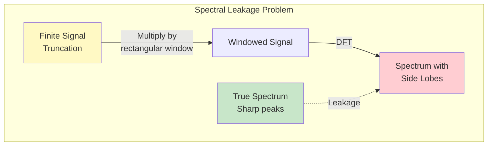
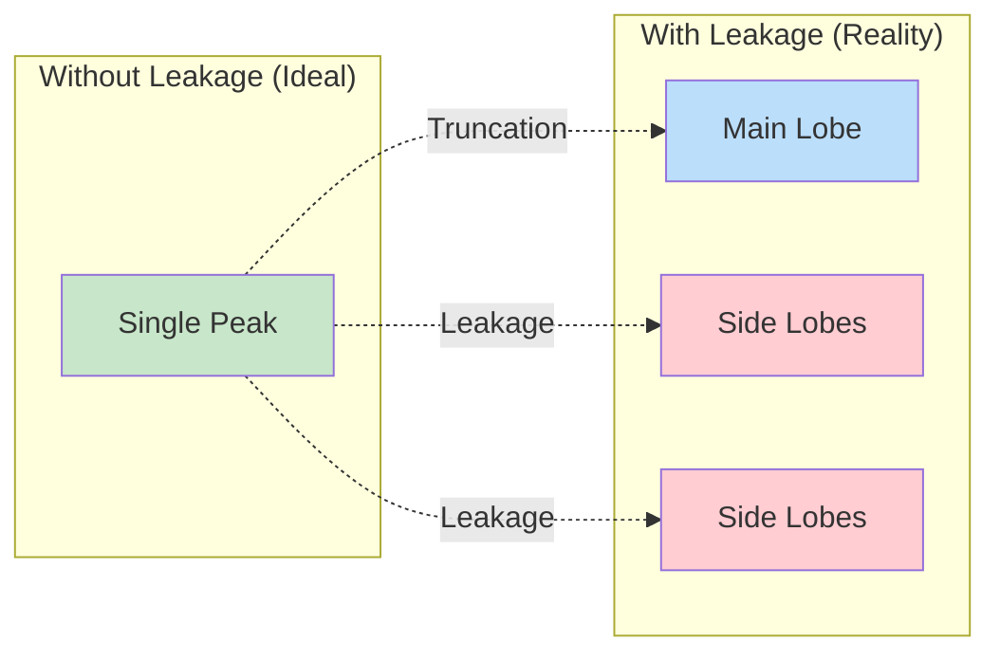
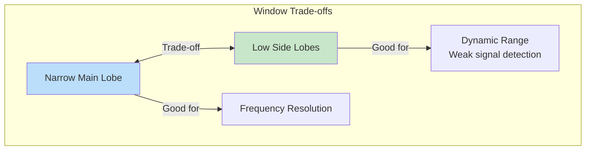
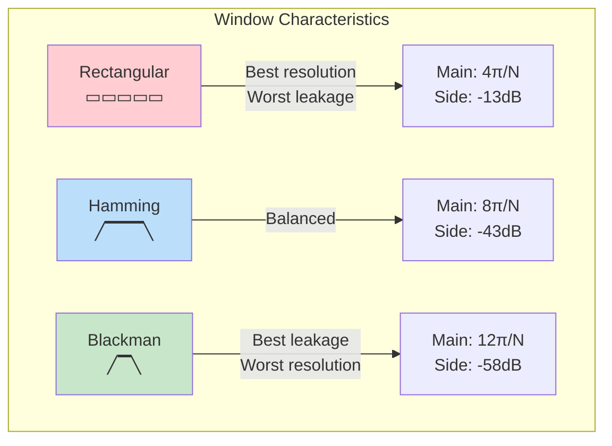
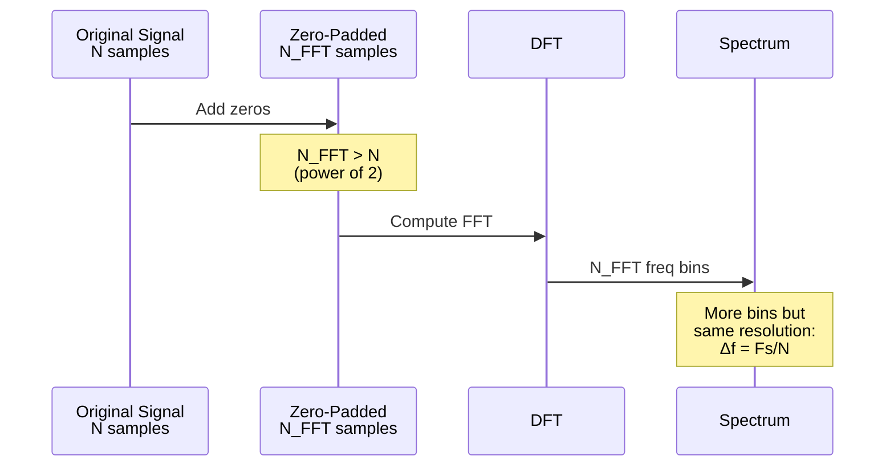
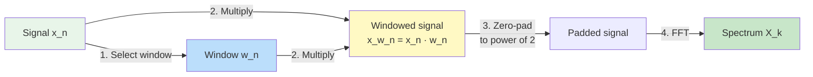
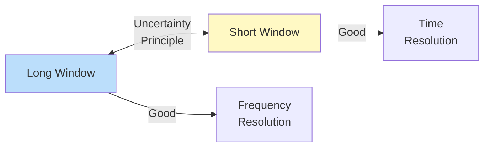

# Module 6: Windowing and Spectral Leakage

## Introduction

When we compute the DFT of a finite-length signal, we implicitly assume the signal is **periodic**. This assumption creates artifacts called **spectral leakage**. **Window functions** help minimize these artifacts by smoothly tapering the signal edges.

## The Spectral Leakage Problem

### Why Does Leakage Occur?

When we extract a finite segment from a signal, we're effectively **multiplying** by a rectangular window:

$$x_{\text{windowed}}[n] = x[n] \cdot w_{\text{rect}}[n]$$

**In frequency domain (multiplication theorem):**

$$X_{\text{windowed}}(e^{j\omega}) = \frac{1}{2\pi} X(e^{j\omega}) \circledast W_{\text{rect}}(e^{j\omega})$$

The spectrum is **convolved** with the window's spectrum, causing **spreading** of spectral lines.

### Rectangular Window Spectrum

The rectangular window has spectrum:

$$W_{\text{rect}}(e^{j\omega}) = \frac{\sin(\omega N/2)}{\sin(\omega/2)} e^{-j\omega(N-1)/2}$$

This is a **sinc function** with:
- Narrow main lobe (good frequency resolution)
- **Large side lobes** (causes leakage!)

### Example: Pure Sinusoid

**Ideal:** Single frequency → single spectral line

**Reality with rectangular window:**
- Main lobe at correct frequency
- **Side lobes spread energy** to adjacent frequencies
- Looks like multiple frequencies present!

## Window Functions

Window functions reduce side lobes by **smoothly tapering** the signal to zero at the edges.

### Design Trade-offs

All windows balance two competing factors:

**Cannot have both!**
- Narrow main lobe → Better frequency resolution BUT higher side lobes
- Low side lobes → Better dynamic range BUT wider main lobe

### Common Window Functions

#### 1. Rectangular Window (No Window)

$$w[n] = \begin{cases}
1 & 0 \leq n \leq N-1 \\
0 & \text{otherwise}
\end{cases}$$

**Characteristics:**
- Main lobe width: $4\pi/N$
- Peak side lobe: **-13 dB** (very high!)
- Best frequency resolution
- Worst side lobe suppression

**Use when:** Maximum frequency resolution needed, weak signals not present

#### 2. Hamming Window

$$w[n] = 0.54 - 0.46 \cos\left(\frac{2\pi n}{N-1}\right)$$

**Characteristics:**
- Main lobe width: $8\pi/N$ (2× rectangular)
- Peak side lobe: **-43 dB**
- Good general-purpose window
- Widely used in practice

**Use when:** Good balance between resolution and leakage needed

#### 3. Hann (Hanning) Window

$$w[n] = 0.5 \left(1 - \cos\left(\frac{2\pi n}{N-1}\right)\right)$$

**Characteristics:**
- Main lobe width: $8\pi/N$
- Peak side lobe: **-32 dB**
- Smooth taper to zero at edges
- Good for general spectral analysis

**Use when:** Smoother than Hamming, good for most applications

#### 4. Blackman Window

$$w[n] = 0.42 - 0.5 \cos\left(\frac{2\pi n}{N-1}\right) + 0.08 \cos\left(\frac{4\pi n}{N-1}\right)$$

**Characteristics:**
- Main lobe width: $12\pi/N$ (3× rectangular)
- Peak side lobe: **-58 dB** (excellent!)
- Very low side lobes
- Wider main lobe

**Use when:** Detecting weak signals in presence of strong ones

#### 5. Kaiser Window

$$w[n] = \frac{I_0\left(\beta \sqrt{1 - \left(\frac{2n}{N-1} - 1\right)^2}\right)}{I_0(\beta)}$$

where $I_0$ is the modified Bessel function of the first kind.

**Characteristics:**
- **Adjustable** via parameter $\beta$
- $\beta = 0$: Rectangular
- $\beta = 5$: Similar to Hamming
- $\beta = 8.6$: Similar to Blackman
- Can optimize for specific requirements

**Use when:** Need to fine-tune main lobe vs side lobe trade-off

### Window Comparison Table

| Window | Main Lobe Width | Peak Side Lobe | Side Lobe Rolloff | Use Case |
|--------|----------------|----------------|-------------------|----------|
| **Rectangular** | $4\pi/N$ | -13 dB | -6 dB/octave | Max resolution |
| **Hann** | $8\pi/N$ | -32 dB | -18 dB/octave | General purpose |
| **Hamming** | $8\pi/N$ | -43 dB | -6 dB/octave | Common default |
| **Blackman** | $12\pi/N$ | -58 dB | -18 dB/octave | Weak signals |
| **Kaiser** | Adjustable | Adjustable | Adjustable | Custom design |

### Visual Comparison

## Zero-Padding

### What is Zero-Padding?

Adding zeros to the end of a signal before computing the DFT:

$$x_{\text{padded}}[n] = \begin{cases}
x[n] & 0 \leq n < N \\
0 & N \leq n < N_{\text{FFT}}
\end{cases}$$

### Effects of Zero-Padding

**What it DOES:**
- Interpolates the DTFT (provides more frequency samples)
- Makes FFT length a power of 2 (efficiency)
- Smoother-looking spectrum

**What it DOES NOT do:**
- ❌ Add new information
- ❌ Improve frequency resolution
- ❌ Reduce spectral leakage

**True frequency resolution** depends only on signal length $N$, not FFT length!

$$\Delta f = \frac{F_s}{N} \quad \text{(signal length, not FFT length)}$$

### Zero-Padding Visualization

**Key Insight:** Zero-padding is **interpolation**, not **resolution enhancement**.

To truly improve resolution: **Collect more data** (increase $N$).

## Applying Windows

### Time Domain Approach

Simply multiply signal by window:

$$x_w[n] = x[n] \cdot w[n]$$

Then compute DFT of $x_w[n]$.

### Frequency Domain Effect

Windowing in time = Convolution in frequency:

$$X_w(e^{j\omega}) = \frac{1}{2\pi} X(e^{j\omega}) \circledast W(e^{j\omega})$$

The sharp spectral lines get "smoothed" by the window spectrum.

### Practical Workflow

## Applications in Filter Design

### FIR Filter Design via Windowing

**Goal:** Design FIR filter with specific frequency response.

**Method:**
1. Start with ideal filter $H_{\text{ideal}}(e^{j\omega})$
2. Compute ideal impulse response (inverse DTFT):
   $$h_{\text{ideal}}[n] = \text{IDTFT}\{H_{\text{ideal}}(e^{j\omega})\}$$
3. Truncate and window:
   $$h[n] = h_{\text{ideal}}[n] \cdot w[n], \quad n = 0, 1, \ldots, M-1$$

**Example: Ideal Lowpass Filter**

$$h_{\text{ideal}}[n] = \frac{\sin(\omega_c n)}{\pi n}$$

This is infinite and non-causal. Window it to get practical FIR filter.

### Window Selection for Filter Design

| Application | Recommended Window | Reason |
|-------------|-------------------|---------|
| **Audio filtering** | Hamming/Hann | Smooth response, low artifacts |
| **Speech processing** | Hamming | Good compromise |
| **Radar/Sonar** | Blackman/Kaiser | Detect weak targets near strong ones |
| **General DSP** | Hann | Safe default choice |
| **Maximum resolution** | Rectangular | When leakage acceptable |

## Spectral Analysis Best Practices

### Choosing Window Length

**Longer window ($N$ large):**
- ✅ Better frequency resolution ($\Delta f = F_s/N$)
- ✅ Narrower main lobe
- ❌ Poorer time resolution
- ❌ Less local in time

**Shorter window ($N$ small):**
- ✅ Better time resolution
- ✅ More local analysis
- ❌ Poorer frequency resolution
- ❌ Wider main lobe

**Trade-off:**

**Heisenberg-Gabor Uncertainty:**

$$\Delta t \cdot \Delta f \geq \frac{1}{4\pi}$$

Cannot achieve arbitrarily good resolution in both time and frequency!

### Practical Guidelines

1. **Window length**: Choose based on required frequency resolution
   $$N \geq \frac{F_s}{\Delta f_{\text{desired}}}$$

2. **Window type**: Based on application
   - Default: Hamming or Hann
   - Weak signals: Blackman or Kaiser
   - Maximum resolution: Rectangular (if leakage OK)

3. **Zero-padding**: Use for
   - FFT efficiency (power of 2)
   - Smoother plots
   - NOT for improving resolution!

4. **Overlap**: For time-varying signals
   - Use 50% or 75% overlap
   - Allows smooth time evolution (STFT)

## Common Pitfalls

### ❌ Mistake 1: Thinking Zero-Padding Improves Resolution

**Reality:** Only collecting more samples improves resolution.

### ❌ Mistake 2: Using Rectangular Window by Default

**Reality:** Usually want some window to reduce leakage.

### ❌ Mistake 3: Ignoring Window Normalization

**Reality:** Window affects signal power. Normalize if needed:

$$\text{Power correction} = \frac{1}{\sum_{n=0}^{N-1} w^2[n]}$$

### ❌ Mistake 4: Wrong Window for Application

**Reality:** Blackman for max resolution? No! Use Rectangular.
Rectangular for weak signal detection? No! Use Blackman.

## Next Steps

In Module 7, we'll explore **correlation** - a powerful tool for signal analysis, pattern matching, and system identification that complements the frequency domain techniques we've learned.

## Exercises

1. Compare spectral leakage with different windows on a pure sinusoid
2. Demonstrate that zero-padding doesn't improve frequency resolution
3. Design an FIR lowpass filter using window method
4. Find optimal Kaiser window parameter for given specifications
5. Analyze time-varying signal using windowed STFT
6. Measure window normalization factors

See `windowing.py` and `windowing.ipynb` for implementations.
