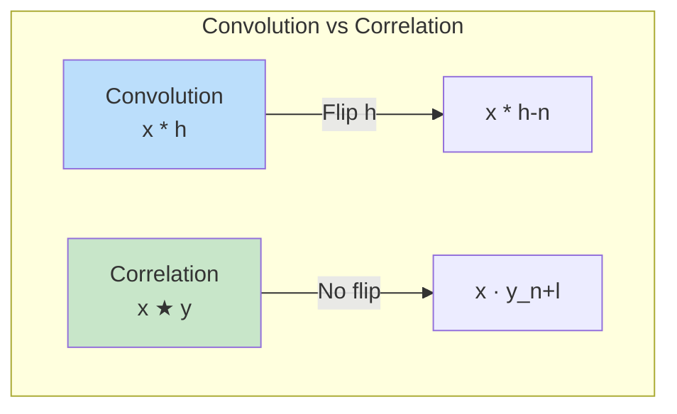
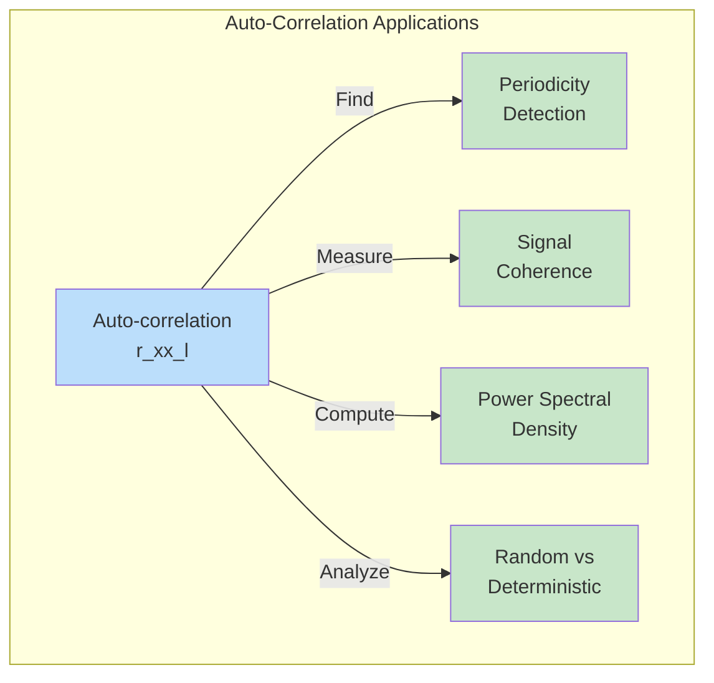
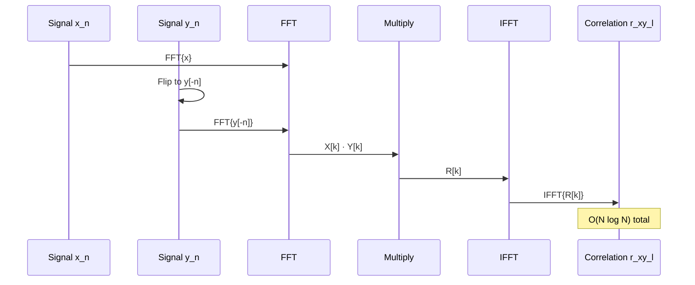
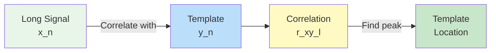
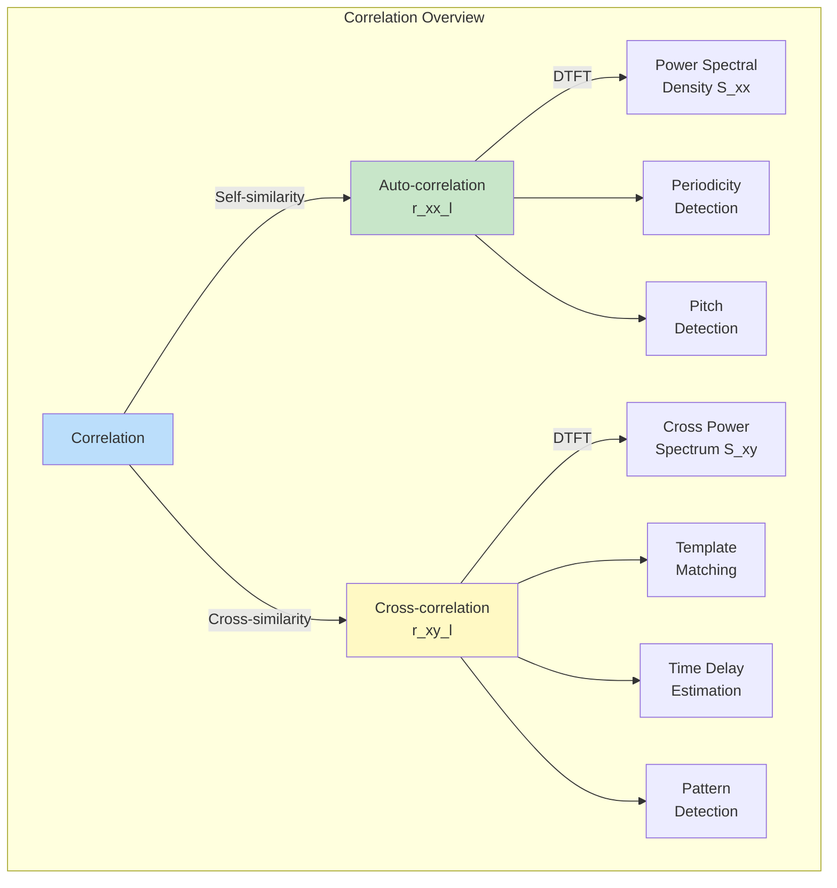

# Module 7: Correlation

## Introduction

**Correlation** is a measure of similarity between signals. It's fundamental to pattern recognition, template matching, signal detection, and system identification. While convolution combines two signals to produce a filtered output, correlation measures how similar two signals are at different time shifts.

## Cross-Correlation

### Definition

The **cross-correlation** between two signals $x[n]$ and $y[n]$ is:

$$r_{xy}[l] = \sum_{n=-\infty}^{\infty} x[n] \cdot y[n+l]$$

where $l$ is the **lag** (time shift).

**Alternative form (equivalent):**

$$r_{xy}[l] = \sum_{n=-\infty}^{\infty} x[n-l] \cdot y[n]$$

### Interpretation

At each lag $l$:
1. Shift signal $y[n]$ by $l$ samples
2. Multiply with $x[n]$ point-by-point
3. Sum all products

**High correlation** → Signals are similar at that lag
**Low correlation** → Signals are dissimilar at that lag

### Relationship to Convolution

Cross-correlation is related to convolution:

$$r_{xy}[l] = x[l] \star y[l] = x[l] * y[-l]$$

where $\star$ denotes correlation and $*$ denotes convolution.

**Key difference:**
- **Convolution**: Flip and shift → $x[n] * h[n] = \sum x[k]h[n-k]$
- **Correlation**: Shift only → $r_{xy}[l] = \sum x[n]y[n+l]$

## Auto-Correlation

### Definition

**Auto-correlation** is the cross-correlation of a signal with itself:

$$r_{xx}[l] = \sum_{n=-\infty}^{\infty} x[n] \cdot x[n+l]$$

### Properties

**1. Symmetry**

$$r_{xx}[l] = r_{xx}[-l]$$

Auto-correlation is **even** (symmetric about $l=0$).

**2. Maximum at Zero Lag**

$$r_{xx}[0] \geq |r_{xx}[l]| \quad \text{for all } l$$

Maximum correlation occurs when signal is aligned with itself.

**3. Energy Relationship**

$$r_{xx}[0] = \sum_{n=-\infty}^{\infty} |x[n]|^2 = E_x$$

Auto-correlation at zero lag equals signal energy.

### Applications

**1. Periodicity Detection**

For periodic signals, auto-correlation shows peaks at multiples of the period.

**2. Pitch Detection**

In speech/audio, peaks in auto-correlation indicate fundamental frequency (pitch).

**3. Noise Analysis**

- White noise: Auto-correlation is impulse
- Colored noise: Auto-correlation reveals correlation structure

## Normalized Correlation

### Why Normalize?

Raw correlation depends on signal amplitude. **Normalized correlation** removes amplitude dependence:

$$\rho_{xy}[l] = \frac{r_{xy}[l]}{\sqrt{r_{xx}[0] \cdot r_{yy}[0]}}$$

where:
- Denominator = geometric mean of signal energies
- Range: $-1 \leq \rho_{xy}[l] \leq 1$

**Interpretation:**
- $\rho = 1$: Perfect positive correlation
- $\rho = 0$: Uncorrelated
- $\rho = -1$: Perfect negative correlation (anti-correlated)

### Correlation Coefficient

For finite signals at a specific lag $l$:

$$\rho_{xy}[l] = \frac{\sum_n (x[n] - \bar{x})(y[n+l] - \bar{y})}{\sqrt{\sum_n (x[n] - \bar{x})^2 \sum_n (y[n+l] - \bar{y})^2}}$$

where $\bar{x}$ and $\bar{y}$ are means.

This removes both amplitude and DC offset effects.

## Properties of Cross-Correlation

### 1. Not Commutative (in general)

$$r_{xy}[l] \neq r_{yx}[l]$$

But:

$$r_{xy}[l] = r_{yx}[-l]$$

### 2. Relation to Convolution

$$r_{xy}[l] = x[l] * y[-l]$$

### 3. Cauchy-Schwarz Inequality

$$|r_{xy}[l]| \leq \sqrt{r_{xx}[0] \cdot r_{yy}[0]}$$

### 4. Frequency Domain

**Wiener-Khinchin Theorem:**

$$r_{xy}[l] \xleftrightarrow{\text{DTFT}} S_{xy}(e^{j\omega}) = X(e^{j\omega}) \cdot Y^*(e^{j\omega})$$

Cross-correlation in time ↔ Cross power spectral density in frequency

For auto-correlation:

$$r_{xx}[l] \xleftrightarrow{\text{DTFT}} S_{xx}(e^{j\omega}) = |X(e^{j\omega})|^2$$

**Auto-correlation ↔ Power Spectral Density**

## Computing Correlation

### Direct Method

Compute summation directly:

$$r_{xy}[l] = \sum_{n} x[n] \cdot y[n+l]$$

**Complexity:** $O(N \cdot L)$ where $L$ is number of lags.

### FFT Method

Use convolution relationship:

$$r_{xy}[l] = x[l] * y[-l]$$

**Algorithm:**
1. Flip $y[n]$ to get $y[-n]$
2. Compute $X[k] = \text{FFT}(x)$
3. Compute $Y[k] = \text{FFT}(y[-n])$
4. Multiply: $R[k] = X[k] \cdot Y[k]$
5. $r_{xy}[l] = \text{IFFT}(R[k])$

**Complexity:** $O(N \log N)$ - much faster for large $N$!

## Applications

### 1. Template Matching

**Problem:** Find where a template appears in a signal.

**Solution:** Compute cross-correlation $r_{xy}[l]$ between signal $x$ and template $y$.

**Peak location** → Template position in signal.

**Example:** Detecting QRS complex in ECG signals.

### 2. Time Delay Estimation

**Problem:** Two sensors receive same signal at different times. Find delay.

**Solution:**
1. Cross-correlate sensor signals
2. Find peak location $l_{\text{max}}$
3. Time delay: $\tau = l_{\text{max}} / F_s$

**Applications:**
- Source localization (sonar, radar)
- Acoustic ranging
- Seismic analysis

### 3. Pattern Detection

**Problem:** Detect known pattern in noisy signal.

**Matched Filter:**

$$h[n] = y[-n]$$

where $y[n]$ is the expected pattern.

Output of matched filter = cross-correlation with pattern.

**Optimal** for detecting signals in white noise (maximizes SNR).

### 4. Pitch Detection (Audio)

**Problem:** Find fundamental frequency of periodic signal (voice, music).

**Solution:**
1. Compute auto-correlation
2. Find first peak after zero lag
3. Peak location → Period $T$
4. Frequency $f_0 = 1/T$

### 5. Image Registration

**Problem:** Align two images (shifted versions).

**Solution:**
1. Compute 2D cross-correlation
2. Find peak location $(x_{\text{shift}}, y_{\text{shift}})$
3. Shift one image to align

(More details in Module 9)

### 6. System Identification

**Problem:** Unknown system $h[n]$, measure input $x[n]$ and output $y[n]$.

**Solution:**

If $x[n]$ is white noise:

$$r_{xy}[l] = r_{xx}[l] * h[l] = \delta[l] * h[l] = h[l]$$

Cross-correlation gives impulse response directly!

## Practical Considerations

### Signal Length and Edge Effects

For finite signals of length $N$:

**Valid correlation range:** $-(N-1) \leq l \leq (N-1)$

At large $|l|$, fewer samples overlap → less reliable correlation.

**Solutions:**
1. Zero-pad signals
2. Only use lags where sufficient overlap exists
3. Normalize by number of overlapping samples

### Bias vs Unbiased Estimation

**Biased estimator:**

$$\hat{r}_{xy}[l] = \frac{1}{N} \sum_{n=0}^{N-1-l} x[n] \cdot y[n+l]$$

**Unbiased estimator:**

$$\hat{r}_{xy}[l] = \frac{1}{N-|l|} \sum_{n=0}^{N-1-|l|} x[n] \cdot y[n+l]$$

Unbiased corrects for fewer samples at large lags.

### Computational Efficiency

| Method | When to Use |
|--------|-------------|
| **Direct** | Few lags needed, short signals |
| **FFT** | Many lags, long signals ($N > 100$) |

**FFT is usually preferred** for complete correlation function.

## Correlation in Frequency Domain

### Power Spectral Density

Auto-correlation and PSD are Fourier transform pairs:

$$r_{xx}[l] \xleftrightarrow{\text{DTFT}} S_{xx}(e^{j\omega})$$

**Wiener-Khinchin Theorem:**

$$S_{xx}(e^{j\omega}) = |X(e^{j\omega})|^2$$

**Practical use:**
- Compute auto-correlation via FFT
- Compute PSD from auto-correlation
- Or: Compute PSD directly from periodogram

### Spectral Analysis via Correlation

**Blackman-Tukey Method:**

1. Estimate auto-correlation $\hat{r}_{xx}[l]$
2. Apply window $w[l]$ to reduce variance
3. Compute PSD: $\hat{S}_{xx}(e^{j\omega}) = \text{DTFT}\{w[l] \cdot \hat{r}_{xx}[l]\}$

**Advantage:** Windowing in lag domain smooths PSD estimate.

## Summary

## Next Steps

In Module 8, we'll extend these concepts to **2D signals and images**, where correlation becomes even more powerful for:
- Image registration and alignment
- Template matching in images
- Texture analysis
- Motion estimation

## Exercises

1. Implement cross-correlation from scratch and verify with FFT method
2. Detect periodic signal buried in noise using auto-correlation
3. Find pitch of musical note from audio sample
4. Implement matched filter for pattern detection
5. Estimate time delay between two sensor signals
6. Compute PSD via Wiener-Khinchin theorem
7. Compare normalized vs unnormalized correlation for template matching

See `correlation.py` and `correlation.ipynb` for implementations.
