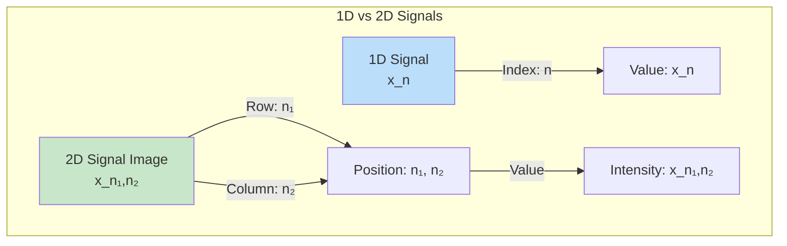
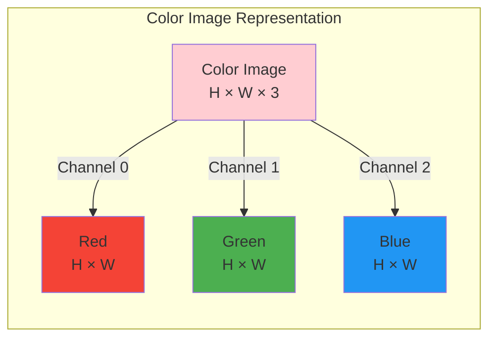
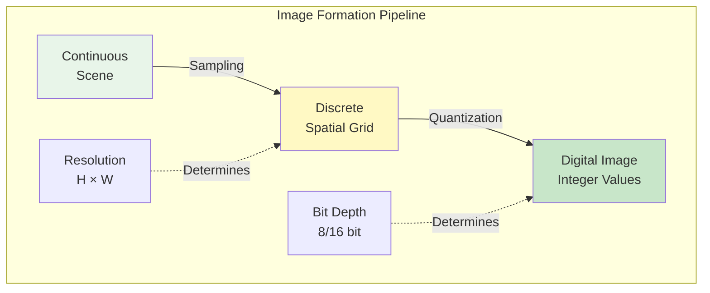
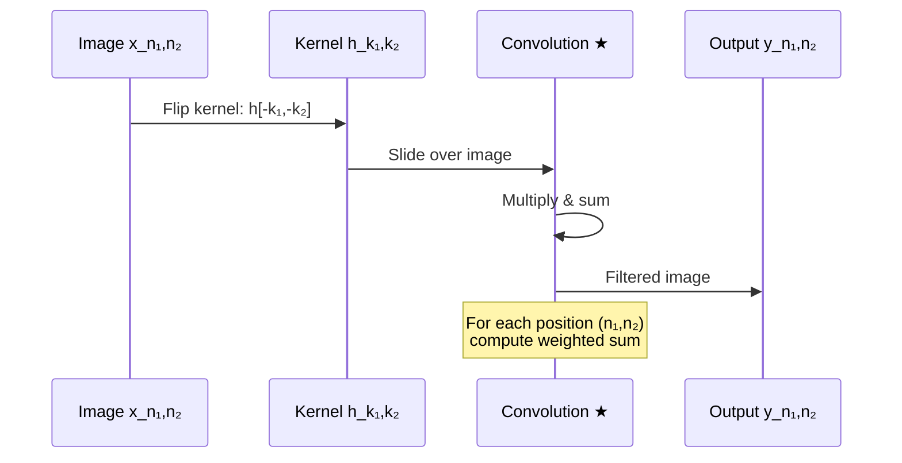
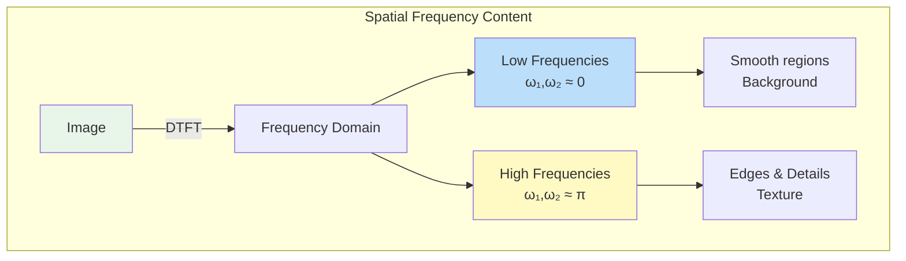
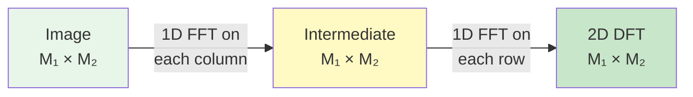
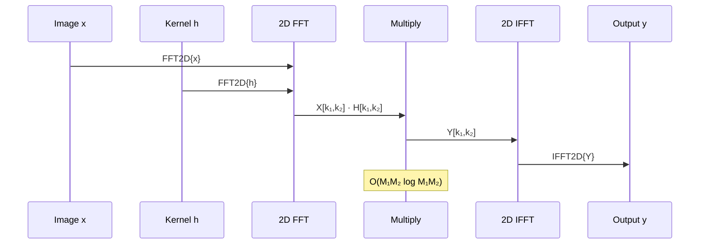
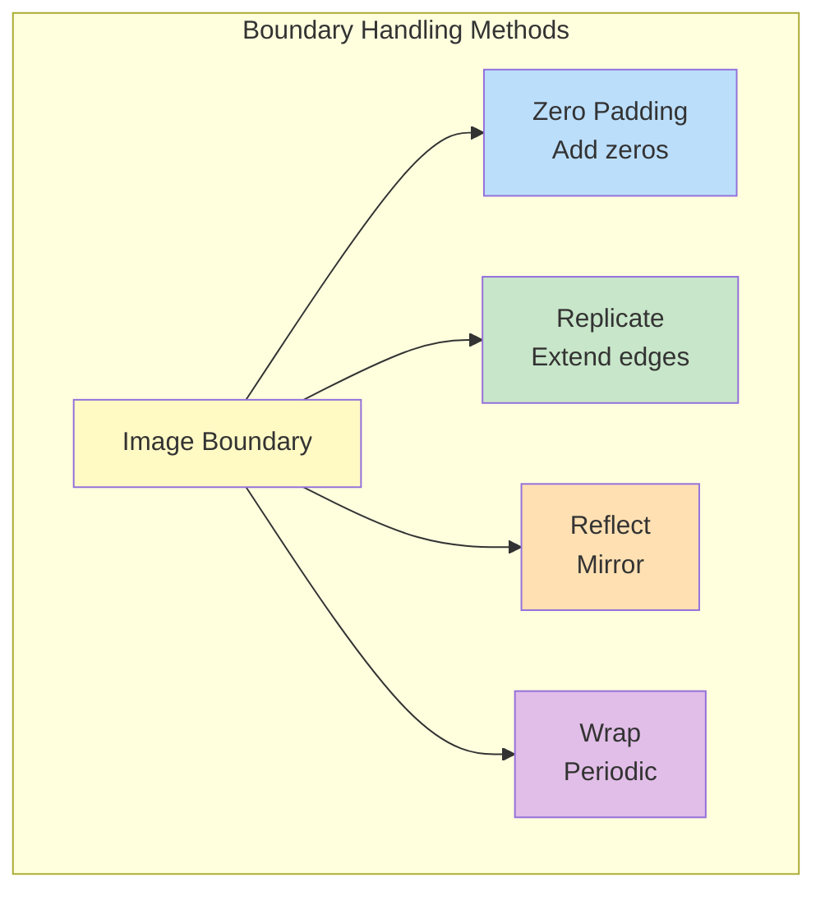
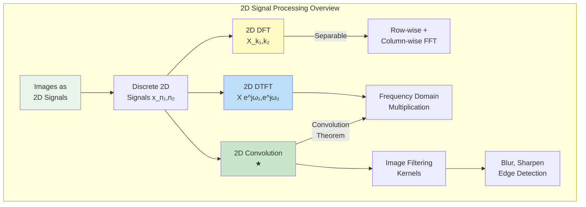

# Module 8: 2D Signals and Images

## Introduction

Images are **2D signals** where the signal value represents brightness (intensity) as a function of spatial position. All the concepts from 1D signal processing—convolution, Fourier transforms, filtering—extend naturally to 2D. This module bridges from 1D signals to 2D images, laying the foundation for image processing and computer vision.

## Images as 2D Signals

### Continuous 2D Signals

A continuous 2D signal is a function of two spatial variables:

$$x(t_1, t_2)$$

where $t_1$ and $t_2$ represent spatial coordinates (e.g., horizontal and vertical position).

**Example:** A photograph represents light intensity at each point $(x, y)$ in space.

### Discrete 2D Signals (Digital Images)

A digital image is a **sampled** and **quantized** 2D signal:

$$x[n_1, n_2]$$

where:
- $n_1$: Row index (vertical position)
- $n_2$: Column index (horizontal position)
- $x[n_1, n_2]$: Pixel intensity value

**Dimensions:**
- Typical sizes: $256 \times 256$, $512 \times 512$, $1920 \times 1080$ (HD), $3840 \times 2160$ (4K)
- Each pixel stores intensity information



## Image Representation

### Grayscale Images

**Single channel** representing brightness:

$$x[n_1, n_2] \in [0, L-1]$$

where $L$ is the number of intensity levels.

**Common formats:**
- **8-bit**: $L = 256$, range $[0, 255]$
- **16-bit**: $L = 65536$, range $[0, 65535]$
- **Floating-point**: $[0.0, 1.0]$ (normalized)

**Interpretation:**
- $0$: Black
- $L-1$: White
- Intermediate values: Shades of gray

### Color Images (RGB)

**Three channels** representing color:

$$\mathbf{x}[n_1, n_2] = \begin{bmatrix} R[n_1, n_2] \\ G[n_1, n_2] \\ B[n_1, n_2] \end{bmatrix}$$

where:
- $R$: Red channel
- $G$: Green channel
- $B$: Blue channel

**Storage:**
- Shape: $(H, W, 3)$ where $H$ is height, $W$ is width
- Each channel: 8-bit $[0, 255]$ typically



### Other Color Spaces

**HSV (Hue, Saturation, Value):**

$$\begin{aligned}
H &: \text{Color hue (angle)} \in [0°, 360°] \\
S &: \text{Color saturation} \in [0, 1] \\
V &: \text{Brightness/value} \in [0, 1]
\end{aligned}$$

**Useful for:** Color-based segmentation, artistic effects

**YCbCr (Luminance, Chrominance):**

$$\begin{aligned}
Y &: \text{Luminance (brightness)} \\
Cb &: \text{Blue chrominance} \\
Cr &: \text{Red chrominance}
\end{aligned}$$

**Useful for:** Video compression (JPEG, MPEG), separating brightness from color

**Conversion RGB → Grayscale:**

$$I[n_1, n_2] = 0.299 \cdot R + 0.587 \cdot G + 0.114 \cdot B$$

Weights reflect human eye's sensitivity to different colors (more sensitive to green).

## 2D Sampling and Resolution

### Spatial Sampling

Images are sampled in 2D space:

**Sampling intervals:**
- $\Delta_1$: Row spacing
- $\Delta_2$: Column spacing

**Sampling frequencies:**

$$F_{s1} = \frac{1}{\Delta_1}, \quad F_{s2} = \frac{1}{\Delta_2}$$

**Resolution:** Number of pixels per unit distance (e.g., dots per inch - DPI)

### 2D Nyquist Theorem

To avoid aliasing in 2D:

$$F_{s1} \geq 2F_{max,1}, \quad F_{s2} \geq 2F_{max,2}$$

where $F_{max,1}$ and $F_{max,2}$ are maximum spatial frequencies in each direction.

**Aliasing in images:**
- Moiré patterns
- Jagged edges (staircasing)
- Loss of fine texture detail

### Quantization

Intensity values are **quantized** to discrete levels:

$$x_q[n_1, n_2] = \text{round}\left(\frac{x[n_1, n_2]}{x_{max}} \cdot (L-1)\right)$$

**Bit depth** determines $L = 2^b$ where $b$ is number of bits.

**Trade-offs:**
- More bits → Better quality, larger file size
- Fewer bits → Banding artifacts, smaller file size



## 2D Systems and Convolution

### 2D Linear Shift-Invariant (LSI) Systems

Extension of 1D LTI systems to 2D:

**Properties:**
1. **Linearity:**
   $$T\{a \cdot x_1 + b \cdot x_2\} = a \cdot T\{x_1\} + b \cdot T\{x_2\}$$

2. **Shift-Invariance:**
   $$x[n_1 - k_1, n_2 - k_2] \rightarrow y[n_1 - k_1, n_2 - k_2]$$

**Impulse Response:** 2D impulse $\delta[n_1, n_2]$ produces output $h[n_1, n_2]$

### 2D Convolution

The output of a 2D LSI system:

$$y[n_1, n_2] = x[n_1, n_2] * h[n_1, n_2]$$

$$y[n_1, n_2] = \sum_{k_1=-\infty}^{\infty} \sum_{k_2=-\infty}^{\infty} x[k_1, k_2] \cdot h[n_1 - k_1, n_2 - k_2]$$

**Alternative form:**

$$y[n_1, n_2] = \sum_{k_1=-\infty}^{\infty} \sum_{k_2=-\infty}^{\infty} h[k_1, k_2] \cdot x[n_1 - k_1, n_2 - k_2]$$

**Interpretation:**
1. Flip $h$ in both dimensions: $h[-k_1, -k_2]$
2. Shift to position $(n_1, n_2)$: $h[n_1 - k_1, n_2 - k_2]$
3. Multiply with $x$
4. Sum all products



### Kernels (Filters)

A **kernel** (or **filter mask**) is a small 2D array used for convolution.

**Common sizes:**
- $3 \times 3$ (most common)
- $5 \times 5$
- $7 \times 7$
- $N \times N$ (odd sizes preferred for symmetry)

**Example: $3 \times 3$ averaging filter:**

$$h = \frac{1}{9} \begin{bmatrix}
1 & 1 & 1 \\
1 & 1 & 1 \\
1 & 1 & 1
\end{bmatrix}$$

This blurs the image by averaging each pixel with its 8 neighbors.

### Properties of 2D Convolution

**1. Commutativity:**

$$x * h = h * x$$

**2. Associativity:**

$$(x * h_1) * h_2 = x * (h_1 * h_2)$$

**3. Distributivity:**

$$x * (h_1 + h_2) = x * h_1 + x * h_2$$

**4. Output Size:**

For image $M_1 \times M_2$ and kernel $N_1 \times N_2$:

$$\text{Output size: } (M_1 + N_1 - 1) \times (M_2 + N_2 - 1)$$

**In practice:** Often use "same" size output by zero-padding or cropping.

## 2D Discrete-Time Fourier Transform (2D DTFT)

### Definition

The 2D DTFT of $x[n_1, n_2]$:

$$X(e^{j\omega_1}, e^{j\omega_2}) = \sum_{n_1=-\infty}^{\infty} \sum_{n_2=-\infty}^{\infty} x[n_1, n_2] e^{-j(\omega_1 n_1 + \omega_2 n_2)}$$

where:
- $\omega_1$: Spatial frequency in direction 1 (vertical)
- $\omega_2$: Spatial frequency in direction 2 (horizontal)

**Inverse 2D DTFT:**

$$x[n_1, n_2] = \frac{1}{(2\pi)^2} \int_{-\pi}^{\pi} \int_{-\pi}^{\pi} X(e^{j\omega_1}, e^{j\omega_2}) e^{j(\omega_1 n_1 + \omega_2 n_2)} d\omega_1 d\omega_2$$

### Periodicity

The 2D DTFT is **periodic** in both frequencies:

$$X(e^{j\omega_1}, e^{j\omega_2}) = X(e^{j(\omega_1 + 2\pi k_1)}, e^{j(\omega_2 + 2\pi k_2)})$$

for any integers $k_1, k_2$.

### Spatial Frequency Interpretation

**Low frequencies:** Slowly varying regions (smooth areas, backgrounds)

**High frequencies:** Rapidly varying regions (edges, textures, details)

**Example:**
- Horizontal edge → High $\omega_1$, low $\omega_2$
- Vertical edge → Low $\omega_1$, high $\omega_2$
- Diagonal edge → High $\omega_1$ and $\omega_2$



## 2D DFT (Discrete Fourier Transform)

### Definition

For an $M_1 \times M_2$ image $x[n_1, n_2]$:

$$X[k_1, k_2] = \sum_{n_1=0}^{M_1-1} \sum_{n_2=0}^{M_2-1} x[n_1, n_2] e^{-j2\pi\left(\frac{k_1 n_1}{M_1} + \frac{k_2 n_2}{M_2}\right)}$$

where:
- $k_1 = 0, 1, \ldots, M_1 - 1$: Frequency index in direction 1
- $k_2 = 0, 1, \ldots, M_2 - 1$: Frequency index in direction 2

**Inverse 2D DFT:**

$$x[n_1, n_2] = \frac{1}{M_1 M_2} \sum_{k_1=0}^{M_1-1} \sum_{k_2=0}^{M_2-1} X[k_1, k_2] e^{j2\pi\left(\frac{k_1 n_1}{M_1} + \frac{k_2 n_2}{M_2}\right)}$$

### Frequency Bins

The DFT samples the DTFT at:

$$\omega_1 = \frac{2\pi k_1}{M_1}, \quad \omega_2 = \frac{2\pi k_2}{M_2}$$

**Physical frequencies** (if pixel spacing $\Delta_1 = \Delta_2 = \Delta$):

$$F_{k_1} = \frac{k_1}{M_1 \Delta}, \quad F_{k_2} = \frac{k_2}{M_2 \Delta}$$

### Separability

**Key property:** The 2D DFT is **separable**:

$$X[k_1, k_2] = \text{DFT}_{rows}\{\text{DFT}_{cols}\{x[n_1, n_2]\}\}$$

**Algorithm:**
1. Apply 1D DFT to each **column** → intermediate result
2. Apply 1D DFT to each **row** of intermediate result → final result

**Advantage:** Reduces complexity from $O(M_1^2 M_2^2)$ to $O(M_1 M_2 (M_1 + M_2))$

With FFT: $O(M_1 M_2 (\log M_1 + \log M_2))$



### DC Component and Centering

**DC component** $X[0, 0]$: Average intensity (sum of all pixel values)

**Standard DFT layout:**
- Low frequencies at corners
- High frequencies at center

**Centered DFT** (via `fftshift`):
- DC at center
- High frequencies at edges
- Better visualization

**Centering:**

$$X_{\text{centered}}[k_1, k_2] = X\left[\left(k_1 + \frac{M_1}{2}\right) \mod M_1, \left(k_2 + \frac{M_2}{2}\right) \mod M_2\right]$$

## 2D Convolution Theorem

**Fundamental relationship:**

$$x[n_1, n_2] * h[n_1, n_2] \xleftrightarrow{\text{DFT}} X[k_1, k_2] \cdot H[k_1, k_2]$$

**Time domain:** 2D convolution (expensive)

**Frequency domain:** Element-wise multiplication (fast!)

### FFT-Based 2D Convolution

**Algorithm:**
1. Zero-pad both $x$ and $h$ to size $(M_1 + N_1 - 1) \times (M_2 + N_2 - 1)$
2. Compute $X[k_1, k_2] = \text{FFT2D}\{x\}$
3. Compute $H[k_1, k_2] = \text{FFT2D}\{h\}$
4. Multiply: $Y[k_1, k_2] = X[k_1, k_2] \cdot H[k_1, k_2]$
5. Compute $y = \text{IFFT2D}\{Y\}$

**Complexity:**
- Direct: $O(M_1 M_2 N_1 N_2)$
- FFT-based: $O(M_1 M_2 \log(M_1 M_2))$ (if $M_1 \approx M_2$)

**When to use:**
- FFT: Large kernels, multiple filtering operations
- Direct: Small kernels ($3 \times 3$, $5 \times 5$)



## Common 2D Kernels

### 1. Box Filter (Averaging)

$$h = \frac{1}{N^2} \begin{bmatrix}
1 & \cdots & 1 \\
\vdots & \ddots & \vdots \\
1 & \cdots & 1
\end{bmatrix}_{N \times N}$$

**Effect:** Blurring (low-pass filtering)

### 2. Gaussian Filter

$$h[n_1, n_2] = \frac{1}{2\pi\sigma^2} e^{-\frac{n_1^2 + n_2^2}{2\sigma^2}}$$

**Effect:** Smooth blurring (better than box), noise reduction

**Separable:** Can be computed as 1D Gaussian in each direction

### 3. Sharpening Filter

$$h = \begin{bmatrix}
0 & -1 & 0 \\
-1 & 5 & -1 \\
0 & -1 & 0
\end{bmatrix}$$

**Effect:** Enhances edges and details (high-pass filtering)

### 4. Edge Detection Kernels

**Sobel (horizontal edges):**

$$h_x = \begin{bmatrix}
-1 & 0 & 1 \\
-2 & 0 & 2 \\
-1 & 0 & 1
\end{bmatrix}$$

**Sobel (vertical edges):**

$$h_y = \begin{bmatrix}
-1 & -2 & -1 \\
0 & 0 & 0 \\
1 & 2 & 1
\end{bmatrix}$$

**Effect:** Detect edges in specific directions

(More details in Module 10)

## Boundary Handling

When convolving near image edges, kernel extends beyond image bounds.

**Solutions:**

### 1. Zero Padding

Assume pixels outside image are zero:

$$x[n_1, n_2] = 0 \quad \text{if } n_1 < 0, n_1 \geq M_1, n_2 < 0, \text{ or } n_2 \geq M_2$$

**Effect:** May darken edges

### 2. Replicate/Clamp

Extend edge pixels:

$$x[-1, n_2] = x[0, n_2], \quad x[M_1, n_2] = x[M_1-1, n_2]$$

**Effect:** More natural for smooth regions

### 3. Reflect/Mirror

Mirror the image at boundaries:

$$x[-1, n_2] = x[1, n_2], \quad x[-2, n_2] = x[2, n_2]$$

**Effect:** Good for symmetric patterns

### 4. Wrap/Periodic

Treat image as periodic (circular convolution):

$$x[-1, n_2] = x[M_1-1, n_2]$$

**Effect:** Natural for FFT-based convolution



## Image Processing Operations

### Point Operations

Operations on individual pixels (no neighborhood):

$$y[n_1, n_2] = f(x[n_1, n_2])$$

**Examples:**
- Brightness adjustment: $y = x + c$
- Contrast: $y = a \cdot x$
- Gamma correction: $y = x^\gamma$
- Thresholding: $y = x > T$ ? $1$ : $0$

### Local Operations (Filtering)

Operations on pixel neighborhoods via convolution:

$$y[n_1, n_2] = \sum_{k_1, k_2} h[k_1, k_2] \cdot x[n_1 - k_1, n_2 - k_2]$$

**Examples:**
- Blurring
- Sharpening
- Edge detection

### Global Operations

Operations using entire image:

$$y = F(x)$$

**Examples:**
- Histogram equalization
- Fourier transform
- Morphological operations

## Visualization of 2D Signals

### Displaying Images

**Intensity images (grayscale):**
- Matplotlib: `plt.imshow(image, cmap='gray')`
- Values mapped to grayscale colormap

**RGB images:**
- Shape: $(H, W, 3)$
- Each channel: $[0, 255]$ or $[0.0, 1.0]$

### Displaying 2D DFT Magnitude

**Magnitude spectrum:**

$$|X[k_1, k_2]| = \sqrt{\text{Re}^2 + \text{Im}^2}$$

**Display with logarithm** (better dynamic range):

$$\text{Display} = \log(1 + |X[k_1, k_2]|)$$

**Center DC component:**
```python
X_centered = np.fft.fftshift(X)
plt.imshow(np.log(1 + np.abs(X_centered)), cmap='gray')
```

### 3D Surface Plots

Visualize intensity as height:
```python
from mpl_toolkits.mplot3d import Axes3D
fig = plt.figure()
ax = fig.add_subplot(111, projection='3d')
ax.plot_surface(n1, n2, x)
```

## Summary



## Key Takeaways

1. **Images are 2D discrete signals** with spatial sampling and quantization
2. **2D DFT is separable** → Efficient computation via 1D FFTs
3. **2D convolution** extends naturally from 1D with double summation
4. **Convolution theorem** enables fast filtering via FFT
5. **Spatial frequencies** represent image detail (low = smooth, high = edges)
6. **Kernels** are small 2D filters applied via convolution
7. **Boundary handling** is crucial for proper edge behavior

## Next Steps

In Module 9, we'll dive deeper into **2D DFT and Image Filtering**, exploring:
- Detailed 2D FFT implementations
- Frequency domain filter design
- Ideal vs practical 2D filters (lowpass, highpass, bandpass)
- Separable filter optimization
- Frequency domain analysis of images

Then in Module 10, we'll cover **Advanced Image Filters**:
- Gaussian filtering and blur
- Sobel, Prewitt edge detection
- Laplacian and Laplacian of Gaussian (LoG)
- Canny edge detector
- Morphological operations

## Exercises

1. Load and display grayscale and RGB images
2. Implement 2D convolution from scratch
3. Compute 2D DFT via separable 1D DFTs
4. Visualize magnitude spectrum of images
5. Apply box and Gaussian blur kernels
6. Compare direct vs FFT-based 2D convolution timing
7. Experiment with different boundary handling modes
8. Convert between color spaces (RGB, HSV, YCbCr)

See `images_2d.py` and `images_2d.ipynb` for implementations.
