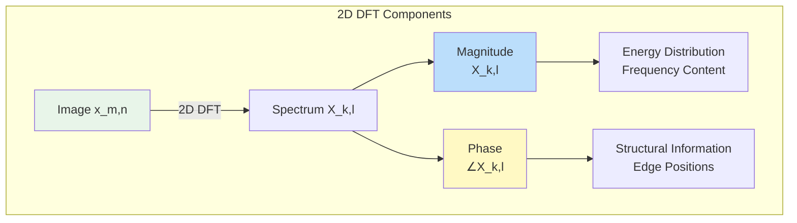
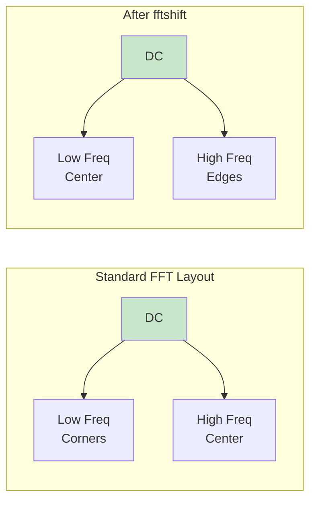
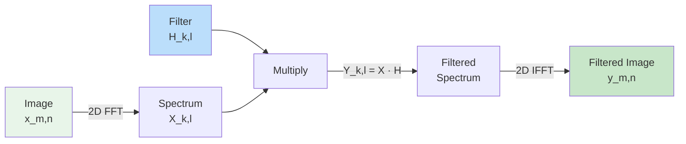
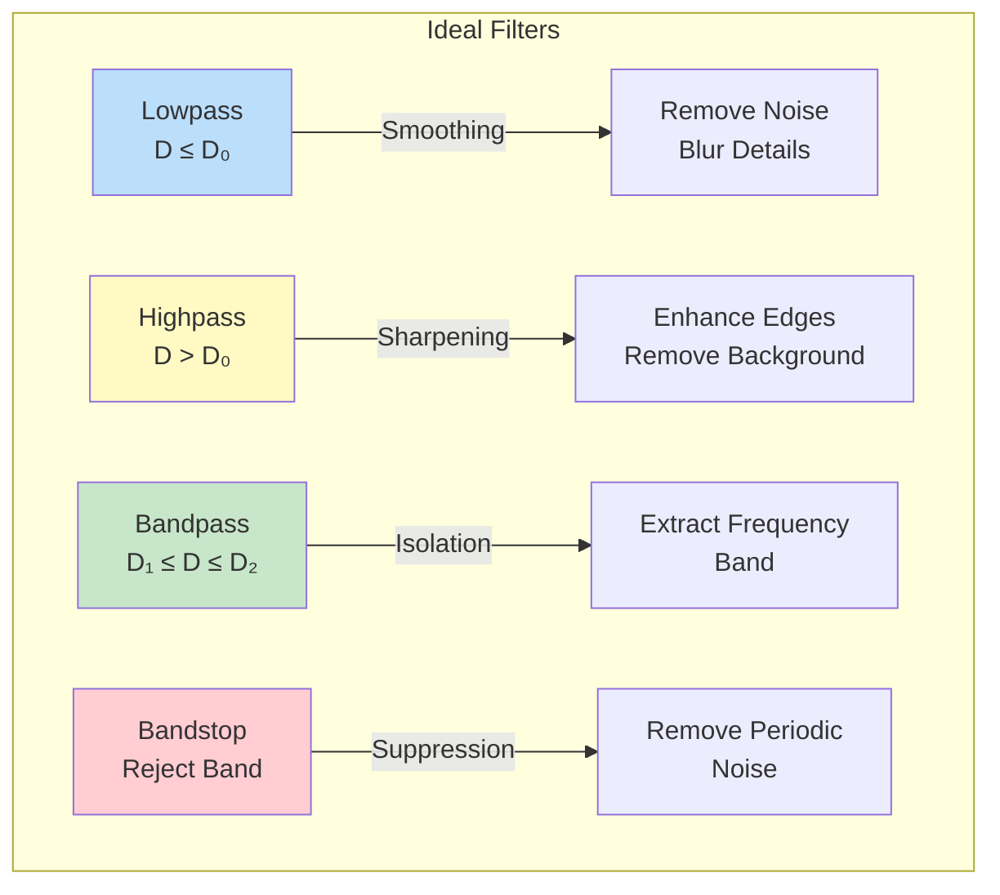
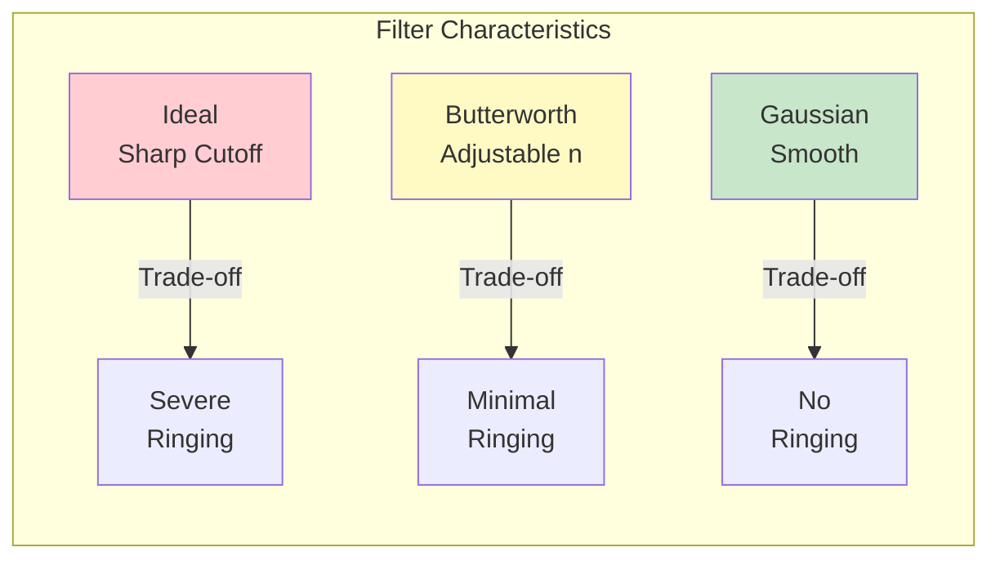
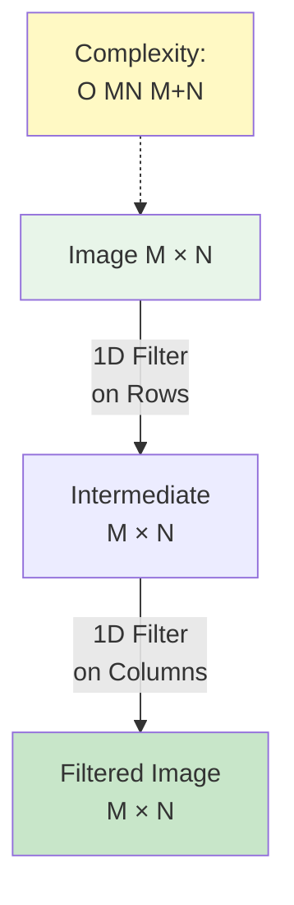
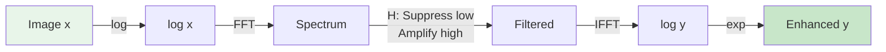
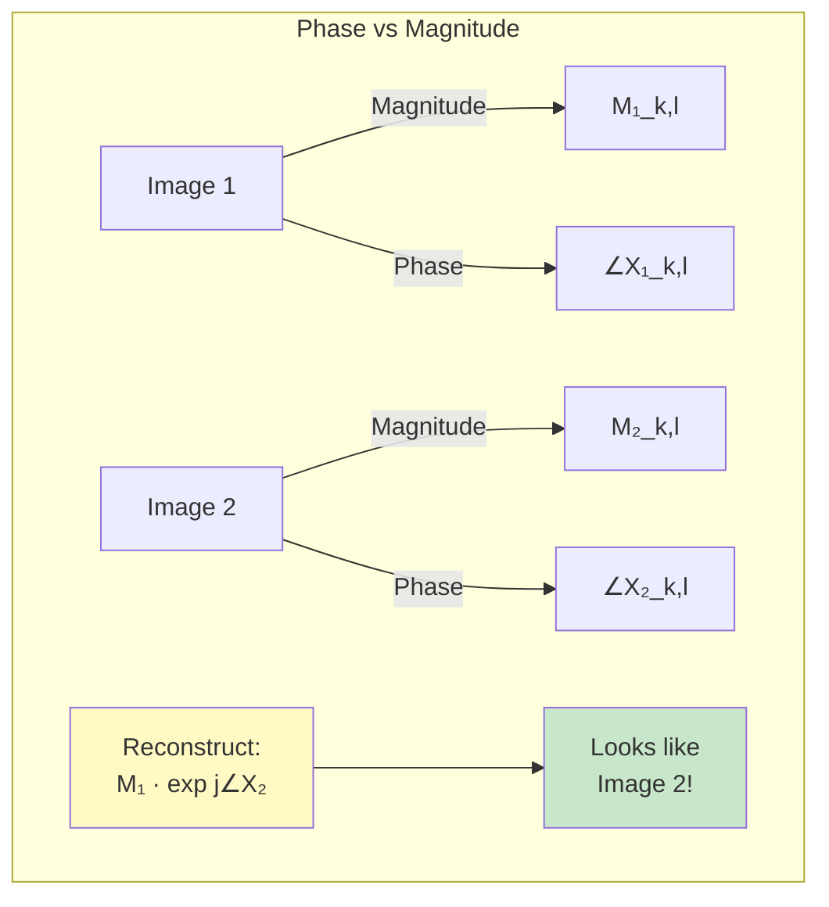
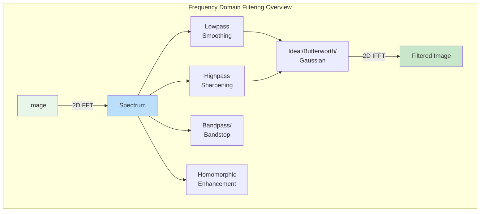

# Module 9: 2D DFT and Image Filtering

## Introduction

Frequency domain filtering is one of the most powerful tools in image processing. By transforming images to the frequency domain via the 2D DFT, we can design sophisticated filters that would be difficult or impossible to implement in the spatial domain. This module explores advanced frequency domain techniques for image enhancement, noise removal, and analysis.

## Review: 2D DFT Fundamentals

### Forward 2D DFT

For an $M \times N$ image $x[m, n]$:

$$X[k, l] = \sum_{m=0}^{M-1} \sum_{n=0}^{N-1} x[m, n] e^{-j2\pi\left(\frac{km}{M} + \frac{ln}{N}\right)}$$

where:
- $k = 0, 1, \ldots, M-1$: Vertical frequency index
- $l = 0, 1, \ldots, N-1$: Horizontal frequency index
- $X[k, l]$: Complex-valued spectrum

### Inverse 2D DFT

$$x[m, n] = \frac{1}{MN} \sum_{k=0}^{M-1} \sum_{l=0}^{N-1} X[k, l] e^{j2\pi\left(\frac{km}{M} + \frac{ln}{N}\right)}$$

### Magnitude and Phase

**Magnitude spectrum:**

$$|X[k, l]| = \sqrt{\text{Re}^2\{X[k, l]\} + \text{Im}^2\{X[k, l]\}}$$

**Phase spectrum:**

$$\angle X[k, l] = \arctan\left(\frac{\text{Im}\{X[k, l]\}}{\text{Re}\{X[k, l]\}}\right)$$

**Key insight:** Magnitude contains frequency content information, phase contains structural information.



## Frequency Domain Interpretation

### Spatial Frequency

The frequency at bin $(k, l)$ corresponds to spatial frequency:

$$\omega_k = \frac{2\pi k}{M}, \quad \omega_l = \frac{2\pi l}{N}$$

**Distance from origin** (DC component):

$$D(k, l) = \sqrt{k^2 + l^2}$$

represents the spatial frequency magnitude.

### DC Component

**DC component** $X[0, 0]$:

$$X[0, 0] = \sum_{m=0}^{M-1} \sum_{n=0}^{N-1} x[m, n]$$

This is the **sum of all pixel values** (proportional to average intensity).

### Frequency Quadrants

Standard FFT output has:
- **Low frequencies**: Corners
- **High frequencies**: Center

After `fftshift`:
- **Low frequencies**: Center (DC at exact center)
- **High frequencies**: Edges



## 2D Filtering in Frequency Domain

### Convolution Theorem (2D)

$$y[m, n] = x[m, n] * h[m, n] \xleftrightarrow{\text{DFT}} Y[k, l] = X[k, l] \cdot H[k, l]$$

**Spatial domain:** Convolution (slow)
**Frequency domain:** Multiplication (fast!)

### Filtering Procedure



**Algorithm:**
1. Compute $X[k, l] = \text{FFT2D}\{x[m, n]\}$
2. Design or define filter $H[k, l]$
3. Multiply: $Y[k, l] = X[k, l] \cdot H[k, l]$
4. Compute $y[m, n] = \text{IFFT2D}\{Y[k, l]\}$

## Ideal Frequency Domain Filters

### 1. Ideal Lowpass Filter (ILPF)

**Removes high frequencies** (smooths image, removes noise and details):

$$H[k, l] = \begin{cases}
1 & \text{if } D(k, l) \leq D_0 \\
0 & \text{if } D(k, l) > D_0
\end{cases}$$

where:
- $D(k, l) = \sqrt{(k - M/2)^2 + (l - N/2)^2}$: Distance from center (after fftshift)
- $D_0$: Cutoff frequency

**Effect:**
- ✅ Removes high-frequency noise
- ❌ Causes ringing artifacts (Gibbs phenomenon)

**Problem:** Sharp cutoff in frequency → ringing in spatial domain

### 2. Ideal Highpass Filter (IHPF)

**Removes low frequencies** (enhances edges and details):

$$H[k, l] = \begin{cases}
0 & \text{if } D(k, l) \leq D_0 \\
1 & \text{if } D(k, l) > D_0
\end{cases}$$

**Relationship to lowpass:**

$$H_{\text{HP}}[k, l] = 1 - H_{\text{LP}}[k, l]$$

**Effect:**
- ✅ Emphasizes edges and fine details
- ❌ Ringing artifacts
- ❌ Removes DC (image becomes very dark)

### 3. Ideal Bandpass Filter

**Passes frequencies in a band** $[D_1, D_2]$:

$$H[k, l] = \begin{cases}
1 & \text{if } D_1 \leq D(k, l) \leq D_2 \\
0 & \text{otherwise}
\end{cases}$$

**Applications:** Isolating specific frequency ranges

### 4. Ideal Bandstop (Notch) Filter

**Blocks frequencies in a band** $[D_1, D_2]$:

$$H[k, l] = \begin{cases}
0 & \text{if } D_1 \leq D(k, l) \leq D_2 \\
1 & \text{otherwise}
\end{cases}$$

**Applications:** Removing periodic noise (e.g., moiré patterns)



## Smooth Frequency Domain Filters

Ideal filters cause **ringing** due to sharp transitions. **Smooth filters** have gradual transitions.

### 1. Butterworth Lowpass Filter (BLPF)

$$H[k, l] = \frac{1}{1 + \left(\frac{D(k, l)}{D_0}\right)^{2n}}$$

where:
- $D_0$: Cutoff frequency (where $H = 0.5$)
- $n$: Filter order (controls transition sharpness)

**Properties:**
- $n = 1$: Gradual transition, minimal ringing
- $n \to \infty$: Approaches ideal filter
- **No ringing** for reasonable $n$

**At cutoff:** $H[k, l] = 0.5$ (-3 dB point)

### 2. Butterworth Highpass Filter (BHPF)

$$H[k, l] = \frac{1}{1 + \left(\frac{D_0}{D(k, l)}\right)^{2n}}$$

**Relationship:**

$$H_{\text{BHP}} = 1 - H_{\text{BLP}}$$

### 3. Gaussian Lowpass Filter (GLPF)

$$H[k, l] = e^{-\frac{D^2(k, l)}{2\sigma^2}}$$

where $\sigma$ controls the width (analogous to cutoff frequency).

**Properties:**
- **Smoothest** transition
- **No ringing** at all
- Transform of Gaussian is Gaussian (separable!)
- Most commonly used in practice

### 4. Gaussian Highpass Filter (GHPF)

$$H[k, l] = 1 - e^{-\frac{D^2(k, l)}{2\sigma^2}}$$

### Filter Comparison

| Filter Type | Transition | Ringing | Use Case |
|-------------|------------|---------|----------|
| **Ideal** | Sharp | Yes (severe) | Theoretical analysis |
| **Butterworth** | Adjustable | Minimal | General purpose |
| **Gaussian** | Smooth | None | Best quality, most common |



## Frequency Domain Filter Design

### Creating Frequency Domain Masks

**Steps:**
1. Create frequency grid matching image size
2. Compute distance from center: $D(k, l)$
3. Apply filter equation
4. Use `fftshift` to position correctly

**Example (Python):**
```python
M, N = image.shape
k = np.arange(M)
l = np.arange(N)
kk, ll = np.meshgrid(k - M//2, l - N//2, indexing='ij')
D = np.sqrt(kk**2 + ll**2)

# Butterworth lowpass, order 2, cutoff 30
H = 1 / (1 + (D / 30)**(2*2))
H = np.fft.ifftshift(H)  # Move to standard FFT layout
```

### Filter Cutoff Selection

**Lowpass cutoff $D_0$:**
- Small $D_0$: More smoothing, more blur
- Large $D_0$: Less smoothing, retains details

**Rule of thumb:**
- **Noise removal**: $D_0 \approx 0.1 \times \min(M, N)$
- **Moderate smoothing**: $D_0 \approx 0.2 \times \min(M, N)$
- **Subtle smoothing**: $D_0 \approx 0.3 \times \min(M, N)$

**Highpass cutoff:**
- Small $D_0$: Preserves more structure
- Large $D_0$: Emphasizes only finest details

## Separable Filters

A 2D filter is **separable** if it can be written as:

$$H[k, l] = H_1[k] \cdot H_2[l]$$

**Advantages:**
- Can be implemented as **two 1D filters** (rows then columns)
- **Much faster**: $O(MN(M+N))$ vs $O(M^2N^2)$
- Gaussian filters are separable!

**Example: Gaussian filter**

$$H[k, l] = e^{-\frac{k^2 + l^2}{2\sigma^2}} = e^{-\frac{k^2}{2\sigma^2}} \cdot e^{-\frac{l^2}{2\sigma^2}} = H_1[k] \cdot H_2[l]$$



## Advanced Filtering Techniques

### 1. Homomorphic Filtering

**Goal:** Enhance image by separating **illumination** and **reflectance** components.

**Image formation model:**

$$x[m, n] = i[m, n] \cdot r[m, n]$$

where:
- $i[m, n]$: Illumination (low frequency, smooth)
- $r[m, n]$: Reflectance (high frequency, details)

**Problem:** Product in spatial domain, not sum!

**Solution:** Take logarithm:

$$\log(x) = \log(i) + \log(r)$$

Now components are **additive**!

**Homomorphic filtering algorithm:**
1. $z = \log(x)$
2. $Z = \text{FFT}\{z\}$
3. Apply filter $H[k, l]$ that:
   - Attenuates low frequencies (illumination)
   - Amplifies high frequencies (reflectance)
4. $Y = H \cdot Z$
5. $y = \text{IFFT}\{Y\}$
6. $\text{output} = e^y$

**Homomorphic filter:**

$$H[k, l] = (\gamma_H - \gamma_L) \left(1 - e^{-c \cdot D^2(k, l)}\right) + \gamma_L$$

where:
- $\gamma_L < 1$: Attenuation for low frequencies
- $\gamma_H > 1$: Amplification for high frequencies
- $c$: Controls transition

**Effect:** Reduces illumination variation, enhances details.



### 2. Notch Filters

**Remove specific frequencies** (e.g., periodic noise).

**Notch filter at $(k_0, l_0)$:**

$$H[k, l] = \begin{cases}
0 & \text{if } (k, l) = (k_0, l_0) \text{ or } (M-k_0, N-l_0) \\
1 & \text{otherwise}
\end{cases}$$

**Note:** Must zero out **both** $(k_0, l_0)$ and its symmetric point (for real images).

**Applications:**
- Remove moiré patterns
- Remove scanning artifacts
- Eliminate power line interference (50/60 Hz)

### 3. Inverse Filtering

**Problem:** Image degraded by known blur $H[k, l]$ and noise:

$$G[k, l] = H[k, l] \cdot X[k, l] + N[k, l]$$

**Inverse filter:**

$$\hat{X}[k, l] = \frac{G[k, l]}{H[k, l]}$$

**Problem:** Amplifies noise where $H \approx 0$!

**Solution:** Wiener filtering (constrained least squares).

### 4. Wiener Filtering

**Optimal filter** minimizing mean square error:

$$H_{\text{Wiener}}[k, l] = \frac{H^*[k, l]}{|H[k, l]|^2 + \frac{S_n[k, l]}{S_x[k, l]}}$$

where:
- $H[k, l]$: Degradation filter
- $S_n$: Noise power spectrum
- $S_x$: Signal power spectrum

**In practice:** Use constant $K = S_n / S_x$

$$H_{\text{Wiener}}[k, l] = \frac{H^*[k, l]}{|H[k, l]|^2 + K}$$

**Advantage:** Balances restoration and noise amplification.

## Practical Considerations

### 1. Zero-Padding for Linear Convolution

**Circular vs Linear convolution:**
- FFT-based: Circular convolution
- Desired: Linear convolution

**Solution:** Zero-pad both image and filter to avoid wrap-around.

**Padding size:**

$$M_{\text{pad}} = M + M_h - 1, \quad N_{\text{pad}} = N + N_h - 1$$

where $M_h \times N_h$ is filter size.

### 2. DC Component Handling

**Highpass filters remove DC** → very dark images.

**Solution:** Rescale output to [0, 1] or add back DC:

$$y_{\text{display}}[m, n] = y[m, n] + \text{mean}(x)$$

### 3. Filter Normalization

For lowpass filters, ensure DC gain = 1:

$$H[0, 0] = 1$$

For energy-preserving filters:

$$\sum_{k, l} |H[k, l]|^2 = MN$$

### 4. Computational Efficiency

**Use FFT for:**
- Large images
- Large filters
- Multiple filtering operations

**Use spatial convolution for:**
- Very small filters ($3 \times 3$, $5 \times 5$)
- One-time operations

## Frequency Domain Analysis

### 1. Image Frequency Content

**Visualizing spectrum:**

$$\text{Display} = \log(1 + |X[k, l]|)$$

Logarithm improves visibility of weak components.

**Interpreting spectrum:**
- Bright center: Strong low frequencies (smooth regions)
- Spread out: Strong high frequencies (edges, textures)
- Radial pattern: Isotropic content
- Directional: Oriented features (lines, edges in specific direction)

### 2. Spectral Concentration

**Energy concentration:**

$$E_{\text{total}} = \sum_{k=0}^{M-1} \sum_{l=0}^{N-1} |X[k, l]|^2$$

**Low-frequency energy** (e.g., within $D \leq D_0$):

$$E_{\text{low}} = \sum_{D(k,l) \leq D_0} |X[k, l]|^2$$

**Energy ratio:**

$$\eta = \frac{E_{\text{low}}}{E_{\text{total}}}$$

High $\eta$ → Most energy in low frequencies (smooth image)

### 3. Phase Importance

**Experiment:** Swap magnitudes of two images, keep phases separate.

**Result:** Phase determines **structure**, magnitude determines **contrast**.



## Summary



## Key Takeaways

1. **Frequency domain filtering** = Multiplication in frequency domain = Convolution in spatial domain
2. **Ideal filters** cause ringing; **Gaussian** and **Butterworth** filters are smooth
3. **Lowpass** smooths and removes noise; **Highpass** enhances edges
4. **Separable filters** are much faster (Gaussian is separable!)
5. **Homomorphic filtering** separates illumination and reflectance
6. **Phase contains structure**; magnitude contains energy distribution
7. **Zero-padding** prevents circular convolution artifacts

## Next Steps

In Module 10, we'll explore **Advanced Image Filters** including:
- Gaussian filtering for noise reduction
- Sobel, Prewitt, and other edge detectors
- Laplacian and Laplacian of Gaussian (LoG)
- Canny edge detector (multi-stage optimal edge detection)
- Morphological operations (erosion, dilation)
- Bilateral filtering (edge-preserving smoothing)

## Exercises

1. Implement Butterworth and Gaussian lowpass/highpass filters
2. Compare ideal, Butterworth, and Gaussian filter characteristics
3. Design notch filter to remove periodic noise
4. Implement homomorphic filtering for uneven illumination
5. Analyze frequency content of different image types
6. Demonstrate phase importance by swapping phase/magnitude
7. Optimize filtering using separable implementation
8. Compare spatial vs frequency domain filtering performance

See `image_filtering_2d.py` and `image_filtering_2d.ipynb` for implementations.
