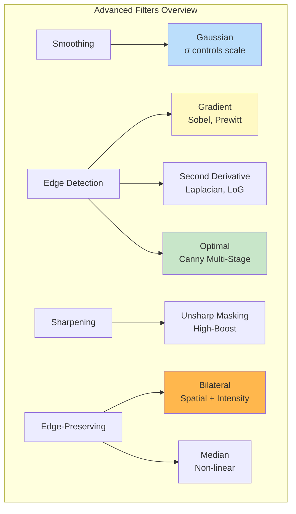

# Module 10: Advanced Image Filters

## Introduction

This module explores advanced image filtering techniques that go beyond basic convolution. These filters are fundamental to computer vision, image enhancement, and feature detection. We'll cover gradient-based edge detection, second-order derivatives, optimal edge detection (Canny), and sophisticated noise reduction methods.

## Gaussian Filtering

### Why Gaussian?

The **Gaussian filter** is the most important smoothing filter in image processing:

$$G(x, y) = \frac{1}{2\pi\sigma^2} e^{-\frac{x^2 + y^2}{2\sigma^2}}$$

**Key properties:**
1. **Separable:** Can be computed as two 1D convolutions
2. **No ringing:** Smooth frequency response
3. **Rotationally symmetric:** Isotropic smoothing
4. **Central Limit Theorem:** Repeated convolution → Gaussian
5. **Scale-space:** Different $\sigma$ represent different scales

### Discrete Gaussian Kernel

For kernel size $N \times N$ (usually odd):

$$G[i, j] = \frac{1}{2\pi\sigma^2} e^{-\frac{(i-c)^2 + (j-c)^2}{2\sigma^2}}$$

where $c = \lfloor N/2 \rfloor$ is the center.

**Normalization:** Ensure sum = 1:

$$G[i, j] \leftarrow \frac{G[i, j]}{\sum_{i,j} G[i, j]}$$

**Kernel size selection:**

$$N \approx 6\sigma + 1$$

(Captures 99.7% of Gaussian's energy)

### Multi-Scale Gaussian Pyramid

**Idea:** Represent image at multiple scales by varying $\sigma$.

**Algorithm:**
1. Start with original image $I_0$
2. For scale $s = 1, 2, \ldots, S$:
   - $\sigma_s = \sigma_0 \cdot k^s$ (e.g., $k = \sqrt{2}$)
   - $I_s = G_{\sigma_s} * I_0$

**Applications:**
- Multi-scale analysis
- SIFT feature detection
- Image blending

## Gradient-Based Edge Detection

**Edges** occur at rapid intensity changes (discontinuities).

**Image gradient:**

$$\nabla I = \begin{bmatrix} \frac{\partial I}{\partial x} \\ \frac{\partial I}{\partial y} \end{bmatrix} = \begin{bmatrix} G_x \\ G_y \end{bmatrix}$$

**Gradient magnitude:**

$$|\nabla I| = \sqrt{G_x^2 + G_y^2}$$

**Gradient direction:**

$$\theta = \arctan\left(\frac{G_y}{G_x}\right)$$

### Sobel Operator

**Most widely used** gradient operator.

**Horizontal gradient (vertical edges):**

$$S_x = \begin{bmatrix}
-1 & 0 & 1 \\
-2 & 0 & 2 \\
-1 & 0 & 1
\end{bmatrix}$$

**Vertical gradient (horizontal edges):**

$$S_y = \begin{bmatrix}
-1 & -2 & -1 \\
0 & 0 & 0 \\
1 & 2 & 1
\end{bmatrix}$$

**Interpretation:**
- **Smoothing** in orthogonal direction: $[1, 2, 1]^T$
- **Differencing** in gradient direction: $[-1, 0, 1]$

**Separable implementation:**

$$S_x = \begin{bmatrix} 1 \\ 2 \\ 1 \end{bmatrix} \cdot \begin{bmatrix} -1 & 0 & 1 \end{bmatrix}$$

$$S_y = \begin{bmatrix} -1 \\ 0 \\ 1 \end{bmatrix} \cdot \begin{bmatrix} 1 & 2 & 1 \end{bmatrix}$$

### Prewitt Operator

Similar to Sobel, but with uniform smoothing:

$$P_x = \begin{bmatrix}
-1 & 0 & 1 \\
-1 & 0 & 1 \\
-1 & 0 & 1
\end{bmatrix}, \quad P_y = \begin{bmatrix}
-1 & -1 & -1 \\
0 & 0 & 0 \\
1 & 1 & 1
\end{bmatrix}$$

**Difference from Sobel:** Equal weights $[1, 1, 1]$ vs weighted $[1, 2, 1]$

### Roberts Cross Operator

**Simplest** gradient operator (2×2):

$$R_x = \begin{bmatrix}
1 & 0 \\
0 & -1
\end{bmatrix}, \quad R_y = \begin{bmatrix}
0 & 1 \\
-1 & 0
\end{bmatrix}$$

Computes gradient along **diagonals** (45° and 135°).

**Advantage:** Very fast
**Disadvantage:** Very sensitive to noise

### Scharr Operator

**Improved** version of Sobel with better rotational symmetry:

$$\text{Scharr}_x = \begin{bmatrix}
-3 & 0 & 3 \\
-10 & 0 & 10 \\
-3 & 0 & 3
\end{bmatrix}$$

Weights: $[3, 10, 3]$ vs Sobel's $[1, 2, 1]$

**Better angular accuracy** for edge orientation.

## Second-Order Derivatives

### Laplacian Operator

**Second derivative** operator (isotropic):

$$\nabla^2 I = \frac{\partial^2 I}{\partial x^2} + \frac{\partial^2 I}{\partial y^2}$$

**Discrete approximation:**

$$\nabla^2 I \approx I[i-1, j] + I[i+1, j] + I[i, j-1] + I[i, j+1] - 4I[i, j]$$

**Kernel (4-connected):**

$$L_4 = \begin{bmatrix}
0 & 1 & 0 \\
1 & -4 & 1 \\
0 & 1 & 0
\end{bmatrix}$$

**Kernel (8-connected, includes diagonals):**

$$L_8 = \begin{bmatrix}
1 & 1 & 1 \\
1 & -8 & 1 \\
1 & 1 & 1
\end{bmatrix}$$

**Properties:**
- **Zero-crossing** indicates edge
- **Magnitude** indicates edge strength
- **Very sensitive to noise** (second derivative amplifies noise!)

### Laplacian of Gaussian (LoG)

**Problem:** Laplacian is very noise-sensitive.

**Solution:** Smooth first with Gaussian, then apply Laplacian.

$$\text{LoG} = \nabla^2 (G_\sigma * I) = (\nabla^2 G_\sigma) * I$$

(By associativity of convolution)

**LoG kernel:**

$$\text{LoG}(x, y) = -\frac{1}{\pi\sigma^4} \left(1 - \frac{x^2 + y^2}{2\sigma^2}\right) e^{-\frac{x^2 + y^2}{2\sigma^2}}$$

**Mexican hat** shape (inverted Gaussian with negative values around edges).

**Characteristics:**
- Rotationally symmetric
- Zero mean (DC component = 0)
- **Blob detector:** Responds strongly to blobs of size $\sim \sigma$

**Edge detection:**
1. Convolve image with LoG
2. Find **zero-crossings**
3. Threshold by magnitude

**Advantage over Laplacian:**
- Less noise sensitivity
- Scale parameter $\sigma$ controls scale of edges detected

### Difference of Gaussians (DoG)

**Efficient approximation** to LoG:

$$\text{DoG} = G_{\sigma_1} - G_{\sigma_2}$$

where $\sigma_2 = k \cdot \sigma_1$ (typically $k \approx 1.6$)

**Relationship to LoG:**

$$G_{\sigma_2} - G_{\sigma_1} \approx (\sigma_2 - \sigma_1) \nabla^2 G_\sigma$$

for $\sigma_2 \approx \sigma_1$.

**Advantages:**
- Computationally efficient
- Already available in Gaussian pyramid
- Used in SIFT feature detection

## Canny Edge Detector

**Optimal multi-stage edge detector** designed by John Canny (1986).

**Optimality criteria:**
1. **Good detection:** Minimize false positives and negatives
2. **Good localization:** Edge points close to true edges
3. **Single response:** Only one response per edge

### Canny Algorithm

**Step 1: Gaussian Smoothing**

$$I_{\text{smooth}} = G_\sigma * I$$

Remove noise before edge detection.

**Step 2: Compute Gradients**

$$G_x = S_x * I_{\text{smooth}}, \quad G_y = S_y * I_{\text{smooth}}$$

$$M = \sqrt{G_x^2 + G_y^2}, \quad \theta = \arctan(G_y / G_x)$$

**Step 3: Non-Maximum Suppression (NMS)**

Thin edges to single-pixel width:
- For each pixel, compare magnitude $M$ with neighbors **along gradient direction**
- Keep only if $M$ is local maximum along gradient
- Suppress otherwise

**Implementation:** Interpolate gradient direction to 8 discrete angles.

**Step 4: Double Thresholding**

Two thresholds: $T_{\text{low}}$ and $T_{\text{high}}$ (typically $T_{\text{low}} = 0.4 \cdot T_{\text{high}}$)

- **Strong edges:** $M > T_{\text{high}}$
- **Weak edges:** $T_{\text{low}} < M \leq T_{\text{high}}$
- **Non-edges:** $M \leq T_{\text{low}}$

**Step 5: Edge Tracking by Hysteresis**

- Keep all strong edges
- Keep weak edges **only if connected** to strong edges
- Discard all other weak edges

This removes spurious weak edges while preserving edge continuity.

### Canny Parameter Selection

**$\sigma$ (Gaussian smoothing):**
- Small (0.5-1.0): Detect fine details, more noise
- Large (2.0-3.0): Detect only major edges, less noise

**$T_{\text{high}}$:**
- Directly controls edge strength threshold
- Typical: 0.1-0.3 (after normalization to [0, 1])

**$T_{\text{low}}$:**
- Typically $T_{\text{low}} = 0.4 \cdot T_{\text{high}}$

## Image Sharpening

### Unsharp Masking

Classic technique from photography:

**Algorithm:**
1. Blur image: $I_{\text{blur}} = G_\sigma * I$
2. Compute mask: $M = I - I_{\text{blur}}$ (high-frequency component)
3. Add back: $I_{\text{sharp}} = I + \alpha \cdot M$

where $\alpha > 0$ controls sharpening amount.

**Combined form:**

$$I_{\text{sharp}} = I + \alpha(I - G_\sigma * I) = (1 + \alpha)I - \alpha G_\sigma * I$$

**Effect:**
- Enhances edges and fine details
- $\alpha = 1$: Standard sharpening
- $\alpha > 1$: Aggressive sharpening (may amplify noise)

### High-Boost Filtering

Generalization of unsharp masking:

$$I_{\text{boost}} = A \cdot I - G_\sigma * I$$

where $A \geq 1$.

- $A = 1$: High-pass filter
- $A > 1$: High-boost (retains low frequencies + enhances high frequencies)

## Edge-Preserving Filters

### Bilateral Filter

**Problem:** Gaussian smoothing blurs edges.

**Solution:** Weighted average considering **both** spatial distance and intensity similarity.

$$I_{\text{bilateral}}[i, j] = \frac{1}{W} \sum_{k,l} G_{\sigma_s}(||p - q||) \cdot G_{\sigma_r}(|I[p] - I[q]|) \cdot I[q]$$

where:
- $p = (i, j)$: Center pixel
- $q = (k, l)$: Neighbor pixel
- $G_{\sigma_s}$: Spatial Gaussian (distance-based weight)
- $G_{\sigma_r}$: Range Gaussian (intensity similarity weight)
- $W$: Normalization factor

**Two components:**
1. **Spatial weight:** Closer pixels → higher weight (like Gaussian)
2. **Range weight:** Similar intensity → higher weight (NEW!)

**Effect:**
- Smooths flat regions (similar intensities)
- **Preserves edges** (large intensity differences → low weight)

**Parameters:**
- $\sigma_s$: Spatial standard deviation (controls neighborhood size)
- $\sigma_r$: Range standard deviation (controls intensity similarity tolerance)

**Large $\sigma_r$:** Acts more like Gaussian (less edge preservation)
**Small $\sigma_r$:** Strong edge preservation

**Disadvantage:** Computationally expensive (non-linear, not separable)

### Median Filter

**Non-linear** filter that replaces each pixel with **median** of neighborhood:

$$I_{\text{median}}[i, j] = \text{median}\{I[i+k, j+l] : (k, l) \in N\}$$

where $N$ is neighborhood (e.g., $3 \times 3$).

**Properties:**
- **Excellent for salt-and-pepper noise** (isolated extreme values)
- **Preserves edges** (median doesn't average across discontinuities)
- **Non-linear** (not convolution!)

**Disadvantage:**
- More expensive than linear filters
- Can remove fine details (lines thinner than kernel)

## Comparison of Filters

| Filter | Purpose | Edge Preservation | Computational Cost |
|--------|---------|-------------------|-------------------|
| **Gaussian** | Smoothing | No | Low (separable) |
| **Sobel** | Edge detection | N/A | Low |
| **Laplacian** | Edges (2nd derivative) | N/A | Low |
| **LoG** | Multi-scale edges | N/A | Medium |
| **Canny** | Optimal edges | N/A | Medium |
| **Bilateral** | Noise reduction | Yes | High |
| **Median** | Salt-pepper noise | Yes | Medium |

## Summary

## Key Takeaways

1. **Gaussian filtering** is fundamental: separable, no ringing, scale-space representation
2. **Sobel operator** is the standard for gradient computation
3. **Laplacian** detects edges via zero-crossings but is noise-sensitive
4. **LoG** combines smoothing with edge detection
5. **Canny** is the optimal multi-stage edge detector: smoothing → gradient → NMS → hysteresis
6. **Unsharp masking** enhances details by adding back high frequencies
7. **Bilateral filtering** preserves edges while smoothing
8. **Median filter** is best for impulsive noise

## Next Steps

In Module 11, we'll introduce **GPU Acceleration** concepts:
- Parallel computing fundamentals
- CUDA and OpenCL overview
- GPU architecture (threads, blocks, grids)
- Memory hierarchy (global, shared, local)
- When to use GPU acceleration

Then in Module 12, we'll implement **GPU Image Filtering**:
- Parallel convolution on GPU
- Separable filter optimization
- Memory access patterns for performance
- Practical GPU-accelerated image processing

## Exercises

1. Implement Sobel, Prewitt, and Scharr operators and compare
2. Apply Laplacian and LoG to detect edges
3. Implement full Canny edge detector from scratch
4. Create multi-scale Gaussian pyramid
5. Implement Difference of Gaussians (DoG)
6. Compare Gaussian vs Bilateral filtering on noisy images
7. Implement unsharp masking with adjustable parameters
8. Test median filter on salt-and-pepper noise
9. Optimize Sobel using separable implementation

See `advanced_filters.py` and `advanced_filters.ipynb` for implementations.
