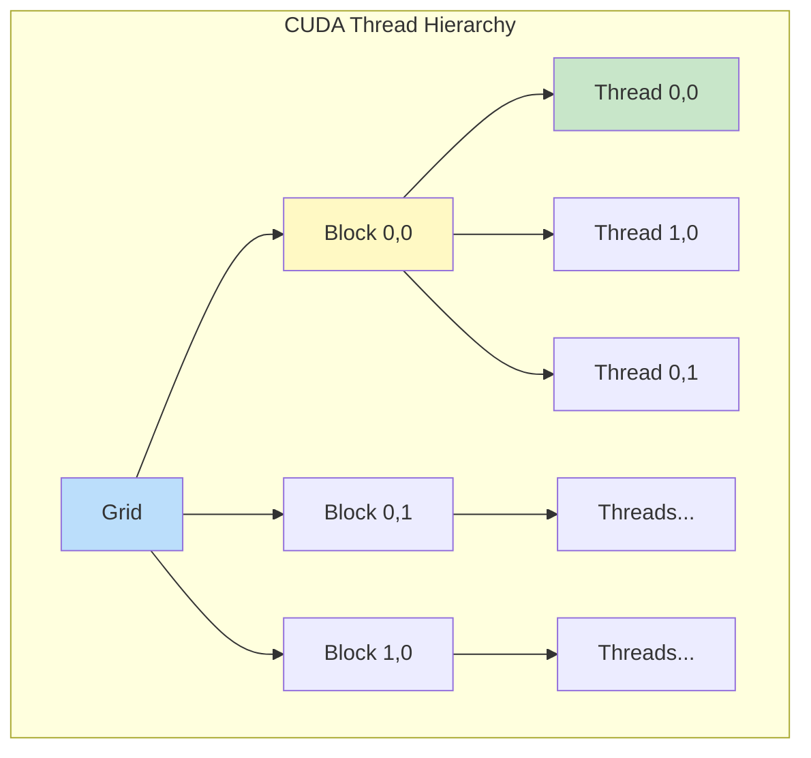

# Module 11: GPU Acceleration Basics

## Introduction

**Graphics Processing Units (GPUs)** were originally designed for graphics rendering but have evolved into powerful parallel processors. Modern GPUs contain thousands of cores capable of executing operations simultaneously, making them ideal for data-parallel tasks like image processing, scientific computing, and machine learning.

This module introduces GPU computing concepts, architectures, and when to leverage GPU acceleration for signal and image processing.

## Why GPU Acceleration?

### CPU vs GPU Architecture

**CPU (Central Processing Unit):**
- Few powerful cores (4-16 typically)
- Optimized for sequential processing
- Large caches, complex control logic
- Low latency, high throughput per core

**GPU (Graphics Processing Unit):**
- Thousands of simpler cores (2000-10000+)
- Optimized for parallel processing
- Smaller caches per core, simpler control
- High throughput via massive parallelism


### When to Use GPU

**Good fit for GPU:**
- ✅ Data-parallel operations (same operation on many data elements)
- ✅ Computationally intensive tasks
- ✅ Large datasets
- ✅ Regular memory access patterns
- ✅ Examples: convolution, matrix multiplication, FFT

**Poor fit for GPU:**
- ❌ Sequential algorithms
- ❌ Irregular control flow (many branches)
- ❌ Small datasets (overhead dominates)
- ❌ Frequent CPU-GPU data transfer

**Performance gain potential:**

$$\text{Speedup} = \frac{T_{\text{CPU}}}{T_{\text{GPU}}}$$

Typical speedups for image processing: **10-100×**

## Parallel Computing Fundamentals

### Data Parallelism

**Same operation** applied to different data elements simultaneously.

**Example: Element-wise addition**

```
C[i] = A[i] + B[i]  for all i
```

On GPU: Each thread computes one element → All elements computed in parallel!


### Task Parallelism

**Different operations** executed simultaneously.

Less common in GPU computing (GPUs excel at data parallelism).

### SIMD vs SIMT

**SIMD** (Single Instruction, Multiple Data):
- One instruction operates on multiple data (e.g., vector instructions)
- CPUs: AVX, SSE

**SIMT** (Single Instruction, Multiple Threads):
- Each thread executes same instruction but on different data
- **GPU model:** Warp/wavefront of threads execute together

## GPU Architecture

### CUDA Architecture (NVIDIA)

**Hierarchy:**

```
Grid
 ├─ Block 0
 │   ├─ Thread 0
 │   ├─ Thread 1
 │   └─ ...
 ├─ Block 1
 │   ├─ Thread 0
 │   └─ ...
 └─ ...
```

**Thread:** Individual execution unit
**Block:** Group of threads (up to 1024 threads)
**Grid:** Collection of blocks

**Example configuration:**
- Grid: 256 blocks
- Block: 256 threads each
- **Total threads:** 256 × 256 = 65,536



### OpenCL Architecture

Similar concepts but with different terminology:

| CUDA | OpenCL |
|------|--------|
| Grid | NDRange |
| Block | Work-group |
| Thread | Work-item |
| Streaming Multiprocessor (SM) | Compute Unit (CU) |

**Platform-agnostic:** Works on NVIDIA, AMD, Intel GPUs

### Streaming Multiprocessors (SMs)

**SM** = Group of CUDA cores with:
- Shared memory
- Register file
- Warp schedulers

**Warp:** 32 threads that execute together (lockstep)

All threads in a warp execute the **same instruction** simultaneously (SIMT).

## Memory Hierarchy

GPU memory has multiple levels with different speeds and accessibility:

### 1. Global Memory

**Characteristics:**
- Largest (GBs)
- Slowest (100s of cycles latency)
- Accessible by all threads
- Persistent across kernel launches

**Use:** Main data storage (images, arrays)

### 2. Shared Memory

**Characteristics:**
- Small (48-96 KB per block)
- Fast (few cycles latency)
- Shared within a block
- Manually managed

**Use:** Inter-thread communication, data reuse, caching

### 3. Local/Private Memory

**Characteristics:**
- Per-thread storage
- Actually in global memory (slow if used)
- Automatic (compiler managed)

**Use:** Thread-local variables

### 4. Registers

**Characteristics:**
- Fastest (1 cycle)
- Very limited (thousands per SM, shared among threads)
- Per-thread

**Use:** Frequently accessed variables

### 5. Constant Memory

**Characteristics:**
- Read-only from kernel
- Cached
- Small (64 KB)

**Use:** Kernel parameters, filter coefficients

### 6. Texture Memory

**Characteristics:**
- Read-only, cached
- Optimized for 2D spatial locality
- Hardware interpolation

**Use:** Image sampling, lookups


### Memory Access Patterns

**Coalesced access:** Adjacent threads access adjacent memory → **Fast** (single transaction)

**Uncoalesced access:** Threads access scattered memory → **Slow** (multiple transactions)

**Example:**

```
// Coalesced (GOOD)
Thread 0: data[0]
Thread 1: data[1]
Thread 2: data[2]
...

// Uncoalesced (BAD)
Thread 0: data[0]
Thread 1: data[100]
Thread 2: data[200]
...
```

## Programming Models

### CUDA (NVIDIA-specific)

**Language:** C/C++ with extensions

**Basic structure:**

```cuda
// Kernel function (runs on GPU)
__global__ void vectorAdd(float *A, float *B, float *C, int N) {
    int i = blockIdx.x * blockDim.x + threadIdx.x;
    if (i < N) {
        C[i] = A[i] + B[i];
    }
}

// Host code (runs on CPU)
int main() {
    // Allocate device memory
    cudaMalloc(&d_A, size);
    cudaMalloc(&d_B, size);
    cudaMalloc(&d_C, size);

    // Copy data to device
    cudaMemcpy(d_A, h_A, size, cudaMemcpyHostToDevice);
    cudaMemcpy(d_B, h_B, size, cudaMemcpyHostToDevice);

    // Launch kernel
    int threadsPerBlock = 256;
    int blocksPerGrid = (N + threadsPerBlock - 1) / threadsPerBlock;
    vectorAdd<<<blocksPerGrid, threadsPerBlock>>>(d_A, d_B, d_C, N);

    // Copy result back
    cudaMemcpy(h_C, d_C, size, cudaMemcpyDeviceToHost);

    // Free memory
    cudaFree(d_A);
    cudaFree(d_B);
    cudaFree(d_C);
}
```

### OpenCL (Cross-platform)

**Language:** C99-based kernel language

**Structure:** Similar to CUDA but more verbose (platform, device, context, queue setup)

### High-Level Python Libraries

**CuPy:** NumPy-like API for CUDA

```python
import cupy as cp

# Arrays automatically on GPU
a = cp.array([1, 2, 3])
b = cp.array([4, 5, 6])
c = a + b  # Computed on GPU
```

**PyOpenCL:** Python bindings for OpenCL

**PyTorch/TensorFlow:** Deep learning frameworks with GPU support

## Parallel Patterns for Image Processing

### 1. Element-wise Operations

**Pattern:** Each thread processes one pixel independently

**Example:** Brightness adjustment, color conversion

```cuda
__global__ void brighten(float *image, float factor, int N) {
    int i = blockIdx.x * blockDim.x + threadIdx.x;
    if (i < N) {
        image[i] = image[i] * factor;
    }
}
```

**Complexity:** $O(N)$ with $N$ threads → $O(1)$ time!

### 2. Reductions

**Pattern:** Combine all elements into single value (e.g., sum, max, min)

**Challenge:** Requires coordination between threads

**Strategy:** Tree-based parallel reduction

```
Step 1: [1, 2, 3, 4, 5, 6, 7, 8]
         ↓  ↓  ↓  ↓  ↓  ↓  ↓  ↓
Step 2: [3,    7,    11,   15   ]
         ↓     ↓     ↓     ↓
Step 3: [10,        26            ]
         ↓           ↓
Step 4: [36                       ]
```

**Complexity:** $O(\log N)$ steps with $N/2$ threads per step

### 3. Stencil/Convolution

**Pattern:** Each output pixel depends on neighborhood of input pixels

**Example:** Gaussian blur, Sobel filter

**Strategy:**
- Each thread computes one output pixel
- Load neighborhood from global memory
- Use shared memory for tile-based optimization

### 4. Histogram

**Pattern:** Count occurrences of values (e.g., image histogram)

**Challenge:** Multiple threads may write to same bin (atomic operations needed)

**Strategy:** Atomic add or privatization

## Performance Considerations

### Occupancy

**Occupancy** = Ratio of active warps to maximum warps per SM

**Goal:** High occupancy (> 50%) for latency hiding

**Factors:**
- Threads per block
- Registers per thread
- Shared memory per block

**Guideline:** Use multiples of warp size (32)
**Typical:** 128, 256, 512 threads per block

### Memory Bandwidth

**Bottleneck:** Often memory-bound, not compute-bound

**Optimization:**
- Coalesced memory access
- Minimize global memory access
- Use shared memory for reuse
- Texture memory for images

### Arithmetic Intensity

$$\text{Arithmetic Intensity} = \frac{\text{FLOPs}}{\text{Bytes Transferred}}$$

**High AI:** Compute-bound (good for GPU)
**Low AI:** Memory-bound (limited by bandwidth)

**Example:**
- Element-wise add: AI = 1/8 (low, memory-bound)
- Matrix multiply: AI = $O(N)$ (high, compute-bound)

### Host-Device Transfer

**Major overhead:** PCIe transfer is slow (16 GB/s typical)

**Minimize transfers:**
- Batch operations on GPU
- Keep data on GPU between kernels
- Use pinned memory for faster transfers


## Debugging and Profiling

### Debugging Tools

**CUDA:**
- `cuda-gdb`: GPU debugger
- `compute-sanitizer`: Memory checker

**OpenCL:**
- Platform-specific tools (CodeXL, Intel Graphics Performance Analyzers)

### Profiling Tools

**NVIDIA:**
- `nvprof`: Command-line profiler
- Nsight Systems/Compute: Visual profilers

**Metrics to monitor:**
- Kernel execution time
- Memory transfer time
- Occupancy
- Memory throughput
- Warp divergence

## Practical Workflow


**Steps:**
1. **Identify parallelism:** What can run concurrently?
2. **Choose pattern:** Element-wise, reduction, stencil, etc.
3. **Implement kernel:** Write GPU code
4. **Manage memory:** Allocate, transfer data
5. **Configure execution:** Choose grid/block dimensions
6. **Profile:** Measure performance
7. **Optimize:** Improve memory access, occupancy, etc.
8. **Iterate**

## Summary


## Key Takeaways

1. **GPUs excel at data-parallel tasks** with massive thread parallelism
2. **Memory hierarchy** is critical: optimize for coalesced access and use shared memory
3. **Thread organization:** Grid → Blocks → Threads
4. **Warps execute in lockstep** (32 threads) → avoid divergence
5. **Minimize CPU-GPU transfers** → major bottleneck
6. **High-level libraries** (CuPy, PyTorch) simplify GPU programming
7. **Profile and optimize** memory access patterns for best performance

## Next Steps

In Module 12, we'll apply these concepts to **GPU Image Filtering**:
- Implementing convolution on GPU
- Separable filter optimization on GPU
- Shared memory tiling for performance
- Using CuPy for practical GPU image processing
- Performance analysis and optimization strategies

## Further Reading

- NVIDIA CUDA Programming Guide
- OpenCL Specification
- "Programming Massively Parallel Processors" by Kirk & Hwu
- CuPy documentation
- PyOpenCL documentation

## Exercises

1. Calculate speedup potential for image operations based on arithmetic intensity
2. Design thread/block configuration for different image sizes
3. Analyze memory access patterns for coalescing
4. Estimate occupancy for given kernel requirements
5. Compare CUDA and OpenCL program structure

See Module 12 for GPU implementation examples.
