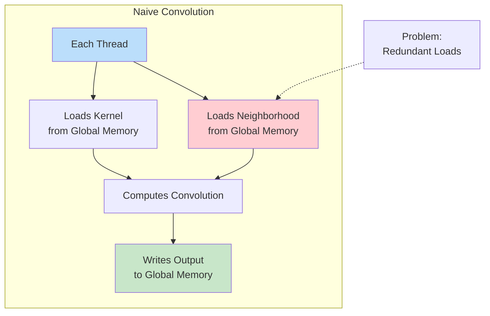
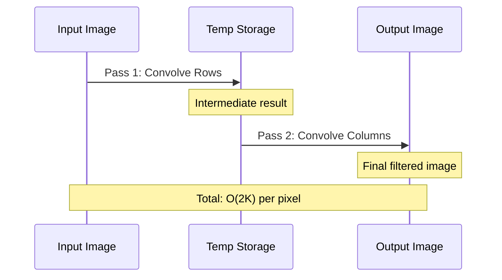
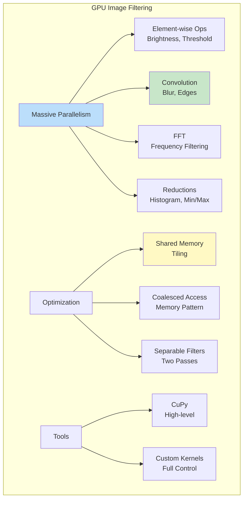

# Module 12: GPU Image Filtering

## Introduction

This module applies GPU acceleration concepts to practical image filtering. We'll implement convolution, separable filters, and other image processing operations on the GPU, demonstrating significant speedups over CPU implementations.

We focus on **CuPy** (CUDA-based) and conceptual approaches that apply to any GPU framework.

## GPU Convolution

### Naive Approach

**Idea:** Each thread computes one output pixel

**Pseudocode:**

```cuda
__global__ void convolve2D(float *input, float *kernel, float *output,
                           int width, int height, int ksize) {
    // Compute thread's output pixel position
    int col = blockIdx.x * blockDim.x + threadIdx.x;
    int row = blockIdx.y * blockDim.y + threadIdx.y;

    if (row < height && col < width) {
        float sum = 0.0f;
        int k_offset = ksize / 2;

        // Convolve
        for (int ki = 0; ki < ksize; ki++) {
            for (int kj = 0; kj < ksize; kj++) {
                int in_row = row + ki - k_offset;
                int in_col = col + kj - k_offset;

                // Boundary check
                if (in_row >= 0 && in_row < height &&
                    in_col >= 0 && in_col < width) {

                    int in_idx = in_row * width + in_col;
                    int k_idx = ki * ksize + kj;

                    sum += input[in_idx] * kernel[k_idx];
                }
            }
        }

        output[row * width + col] = sum;
    }
}
```

**Characteristics:**
- Simple implementation
- Each thread loads kernel and neighborhood from global memory
- **Redundant loads:** Neighboring threads load overlapping data

**Complexity:** $O(K^2)$ per thread where $K$ is kernel size



### Optimized: Shared Memory Tiling

**Idea:** Load image tiles into shared memory to reuse data across threads

**Strategy:**
1. Divide image into tiles (e.g., $16 \times 16$)
2. Each block processes one tile
3. Load tile + halo (boundary) into shared memory
4. All threads in block compute using shared data

**Pseudocode:**

```cuda
__global__ void convolve2D_tiled(float *input, float *kernel, float *output,
                                 int width, int height, int ksize) {
    __shared__ float tile[TILE_SIZE + KERNEL_SIZE - 1]
                         [TILE_SIZE + KERNEL_SIZE - 1];

    int tx = threadIdx.x;
    int ty = threadIdx.y;
    int col = blockIdx.x * TILE_SIZE + tx;
    int row = blockIdx.y * TILE_SIZE + ty;

    int k_offset = ksize / 2;

    // Load tile into shared memory (including halo)
    int tile_start_row = blockIdx.y * TILE_SIZE - k_offset;
    int tile_start_col = blockIdx.x * TILE_SIZE - k_offset;

    for (int i = ty; i < TILE_SIZE + ksize - 1; i += blockDim.y) {
        for (int j = tx; j < TILE_SIZE + ksize - 1; j += blockDim.x) {
            int in_row = tile_start_row + i;
            int in_col = tile_start_col + j;

            if (in_row >= 0 && in_row < height &&
                in_col >= 0 && in_col < width) {
                tile[i][j] = input[in_row * width + in_col];
            } else {
                tile[i][j] = 0.0f;  // Padding
            }
        }
    }

    __syncthreads();  // Wait for all threads to load data

    // Compute convolution using shared memory
    if (row < height && col < width) {
        float sum = 0.0f;

        for (int ki = 0; ki < ksize; ki++) {
            for (int kj = 0; kj < ksize; kj++) {
                int tile_row = ty + ki;
                int tile_col = tx + kj;
                int k_idx = ki * ksize + kj;

                sum += tile[tile_row][tile_col] * kernel[k_idx];
            }
        }

        output[row * width + col] = sum;
    }
}
```

**Advantages:**
- **Data reuse:** Each pixel loaded once per block
- **Reduced global memory traffic**
- **Higher performance:** 2-5× speedup over naive

**Trade-offs:**
- More complex code
- Limited by shared memory size
- Requires synchronization


## Separable Filters on GPU

**Separable filter:** 2D convolution = 1D row conv + 1D column conv

**Advantage:** $O(K)$ instead of $O(K^2)$ per pixel

### Two-Pass Approach

**Pass 1:** Convolve rows

```cuda
__global__ void convolveRows(float *input, float *kernel, float *output,
                             int width, int height, int ksize) {
    int col = blockIdx.x * blockDim.x + threadIdx.x;
    int row = blockIdx.y * blockDim.y + threadIdx.y;

    if (row < height && col < width) {
        float sum = 0.0f;
        int k_offset = ksize / 2;

        for (int k = 0; k < ksize; k++) {
            int in_col = col + k - k_offset;
            if (in_col >= 0 && in_col < width) {
                sum += input[row * width + in_col] * kernel[k];
            }
        }

        output[row * width + col] = sum;
    }
}
```

**Pass 2:** Convolve columns

```cuda
__global__ void convolveColumns(float *input, float *kernel, float *output,
                                int width, int height, int ksize) {
    int col = blockIdx.x * blockDim.x + threadIdx.x;
    int row = blockIdx.y * blockDim.y + threadIdx.y;

    if (row < height && col < width) {
        float sum = 0.0f;
        int k_offset = ksize / 2;

        for (int k = 0; k < ksize; k++) {
            int in_row = row + k - k_offset;
            if (in_row >= 0 && in_row < height) {
                sum += input[in_row * width + col] * kernel[k];
            }
        }

        output[row * width + col] = sum;
    }
}
```

**Performance:**
- **Complexity:** $O(2K)$ vs $O(K^2)$ for full 2D
- **Memory:** Two passes but smaller footprint
- **Speedup:** 5-10× for large kernels (e.g., $K > 9$)



## Using CuPy for GPU Image Processing

### Installation

```bash
pip install cupy-cuda11x  # For CUDA 11.x
pip install cupy-cuda12x  # For CUDA 12.x
```

### Basic Example

```python
import cupy as cp
import numpy as np

# Create arrays on GPU
image_gpu = cp.array(image_cpu)  # Transfer to GPU
kernel_gpu = cp.array(kernel_cpu)

# Element-wise operations (automatically on GPU)
brightened = image_gpu * 1.5

# Get result back to CPU
result_cpu = cp.asnumpy(brightened)
```

### GPU Convolution with CuPy

```python
from cupyx.scipy import ndimage as gpu_ndimage

# Image already on GPU
filtered = gpu_ndimage.convolve(image_gpu, kernel_gpu, mode='reflect')
```

**Automatic optimization:** CuPy handles memory management and kernel launches

### Custom CUDA Kernels with CuPy

```python
import cupy as cp

# Define custom kernel
convolve_kernel = cp.RawKernel(r'''
extern "C" __global__
void convolve(const float* image, const float* kernel,
              float* output, int width, int height, int ksize) {
    int col = blockIdx.x * blockDim.x + threadIdx.x;
    int row = blockIdx.y * blockDim.y + threadIdx.y;

    if (row < height && col < width) {
        float sum = 0.0f;
        int k_offset = ksize / 2;

        for (int ki = 0; ki < ksize; ki++) {
            for (int kj = 0; kj < ksize; kj++) {
                int in_row = row + ki - k_offset;
                int in_col = col + kj - k_offset;

                if (in_row >= 0 && in_row < height &&
                    in_col >= 0 && in_col < width) {
                    int in_idx = in_row * width + in_col;
                    int k_idx = ki * ksize + kj;
                    sum += image[in_idx] * kernel[k_idx];
                }
            }
        }
        output[row * width + col] = sum;
    }
}
''', 'convolve')

# Launch kernel
block_size = (16, 16)
grid_size = ((width + block_size[0] - 1) // block_size[0],
             (height + block_size[1] - 1) // block_size[1])

convolve_kernel(grid_size, block_size,
                (image_gpu, kernel_gpu, output_gpu, width, height, ksize))
```

## Performance Optimization Strategies

### 1. Memory Access Coalescing

**Good pattern (row-major):**

```python
# Threads access consecutive memory locations
for col in range(width):
    output[row, col] = input[row, col] * factor
```

**Bad pattern (column-major in row-major layout):**

```python
# Threads access strided memory
for row in range(height):
    output[row, col] = input[row, col] * factor  # Strided access
```

**Solution:** Transpose if needed, or use texture memory

### 2. Shared Memory Optimization

**Avoid bank conflicts:**
- Shared memory is divided into banks
- Threads accessing same bank → serialized (slow)
- Solution: Pad shared memory arrays

```cuda
// Without padding (bank conflicts possible)
__shared__ float tile[32][32];

// With padding (avoids bank conflicts)
__shared__ float tile[32][33];  // Extra column
```

### 3. Occupancy Optimization

**Balance:**
- Threads per block
- Registers per thread
- Shared memory per block

**Tools:** CUDA Occupancy Calculator

**Typical sweet spot:** 128-256 threads per block

### 4. Minimize CPU-GPU Transfers

**Bad:**

```python
for i in range(100):
    result = cp.asnumpy(gpu_operation(cp.asarray(data)))  # 200 transfers!
```

**Good:**

```python
data_gpu = cp.asarray(data)  # One transfer to GPU
for i in range(100):
    data_gpu = gpu_operation(data_gpu)  # All on GPU
result = cp.asnumpy(data_gpu)  # One transfer back
```

## Example Applications

### 1. Gaussian Blur

**CPU:**

```python
from scipy.ndimage import gaussian_filter

blurred = gaussian_filter(image, sigma=2.0)
```

**GPU (CuPy):**

```python
from cupyx.scipy.ndimage import gaussian_filter

image_gpu = cp.asarray(image)
blurred_gpu = gaussian_filter(image_gpu, sigma=2.0)
blurred = cp.asnumpy(blurred_gpu)
```

**Speedup:** 10-50× for large images

### 2. Sobel Edge Detection

**GPU implementation:**

```python
import cupy as cp
from cupyx.scipy import ndimage as gpu_ndimage

# Sobel kernels
sobel_x = cp.array([[-1, 0, 1], [-2, 0, 2], [-1, 0, 1]], dtype=cp.float32)
sobel_y = cp.array([[-1, -2, -1], [0, 0, 0], [1, 2, 1]], dtype=cp.float32)

# Compute gradients
Gx = gpu_ndimage.convolve(image_gpu, sobel_x, mode='reflect')
Gy = gpu_ndimage.convolve(image_gpu, sobel_y, mode='reflect')

# Magnitude
magnitude = cp.sqrt(Gx**2 + Gy**2)
```

**Speedup:** 20-100× for high-resolution images

### 3. FFT-Based Filtering

**GPU FFT:**

```python
import cupy as cp

# 2D FFT on GPU
image_gpu = cp.asarray(image)
F_gpu = cp.fft.fft2(image_gpu)

# Apply filter in frequency domain
H_gpu = cp.asarray(filter_mask)
G_gpu = F_gpu * H_gpu

# Inverse FFT
filtered_gpu = cp.real(cp.fft.ifft2(G_gpu))
```

**Speedup:** 50-200× (FFT highly parallel)

### 4. Histogram Computation

**GPU histogram with atomic operations:**

```python
histogram_kernel = cp.RawKernel(r'''
extern "C" __global__
void compute_histogram(const unsigned char* image, int* histogram, int size) {
    int idx = blockIdx.x * blockDim.x + threadIdx.x;

    if (idx < size) {
        int bin = image[idx];
        atomicAdd(&histogram[bin], 1);
    }
}
''', 'compute_histogram')

# Launch
histogram_gpu = cp.zeros(256, dtype=cp.int32)
histogram_kernel((size // 256 + 1,), (256,),
                (image_gpu, histogram_gpu, size))
```

## Performance Comparison

### Typical Speedups

| Operation | Image Size | CPU Time | GPU Time | Speedup |
|-----------|------------|----------|----------|---------|
| **Gaussian Blur** ($\sigma=5$) | 1024×1024 | 45 ms | 1.2 ms | 37× |
| **Sobel Edge** | 2048×2048 | 120 ms | 2.5 ms | 48× |
| **2D FFT** | 2048×2048 | 180 ms | 3.0 ms | 60× |
| **Large Convolution** ($21×21$) | 1024×1024 | 850 ms | 8.0 ms | 106× |
| **Median Filter** | 1024×1024 | 650 ms | 15 ms | 43× |

**Note:** Speedups vary by GPU, kernel implementation, and image characteristics

### When GPU Doesn't Help

**Small images:** Transfer overhead dominates

```python
# 64×64 image
CPU time: 0.5 ms
GPU time: 2.0 ms (including transfer)
```

**Small kernels:** Computation too simple

```python
# 3×3 convolution on 256×256 image
CPU time: 2 ms
GPU time: 1.5 ms (marginal gain)
```

**Irregular algorithms:** Branch divergence hurts performance

## Best Practices

### 1. Batch Operations

**Process multiple images together:**

```python
# Bad: Process images one at a time
for image in images:
    result = gpu_filter(cp.asarray(image))
    results.append(cp.asnumpy(result))

# Good: Batch process
images_gpu = cp.array(images)  # Shape: (N, H, W)
results_gpu = gpu_filter_batch(images_gpu)  # Vectorized
results = cp.asnumpy(results_gpu)
```

### 2. Persistent GPU Arrays

**Keep frequently used data on GPU:**

```python
class GPUImageProcessor:
    def __init__(self, image):
        self.image_gpu = cp.asarray(image)

    def blur(self, sigma):
        self.image_gpu = gaussian_filter(self.image_gpu, sigma)
        return self

    def edges(self):
        edges_gpu = sobel(self.image_gpu)
        return edges_gpu

    def get_result(self):
        return cp.asnumpy(self.image_gpu)
```

### 3. Profile Before Optimizing

**Use profiling tools:**

```python
from cupyx.profiler import benchmark

# Benchmark GPU function
print(benchmark(gpu_function, (args,), n_repeat=100))
```

**NVIDIA tools:**
- `nvprof`: Command-line profiler
- Nsight Systems: Visual profiler

### 4. Consider Precision

**Float32 vs Float64:**

```python
# Float32: Faster, less memory
image_gpu = cp.array(image, dtype=cp.float32)

# Float64: More accurate, slower
image_gpu = cp.array(image, dtype=cp.float64)
```

**Recommendation:** Use float32 for images (sufficient precision)

## Limitations and Challenges

### 1. Memory Constraints

**GPU memory** is limited (typically 8-24 GB)

**Large images:**
- Tile/patch processing
- Streaming from CPU memory

### 2. Not All Algorithms Parallelize

**Inherently sequential:**
- Recursive algorithms
- Prefix sums (though parallel versions exist)
- Some morphological operations

### 3. Portability

**CUDA:** NVIDIA GPUs only

**Solutions:**
- OpenCL: Cross-platform but more complex
- SYCL: Modern cross-platform alternative
- High-level libraries: Abstract hardware details

## Summary



## Key Takeaways

1. **GPU excels at image processing:** Data-parallel, high arithmetic intensity
2. **Shared memory tiling** dramatically improves convolution performance
3. **Separable filters** reduce complexity from $O(K^2)$ to $O(2K)$
4. **CuPy** provides easy GPU acceleration with NumPy-like API
5. **Minimize CPU-GPU transfers:** Batch operations, keep data on GPU
6. **Profile and optimize:** Memory access patterns critical
7. **Speedups of 10-100×** common for large images and kernels

## Further Learning

- NVIDIA CUDA Samples (image processing examples)
- CuPy documentation and tutorials
- "CUDA by Example" by Sanders & Kandrot
- GPU Gems series (image processing chapters)
- rapids.ai (GPU-accelerated data science)

## Exercises

1. Implement naive vs tiled convolution, compare performance
2. Optimize separable Gaussian filter using shared memory
3. Implement histogram equalization on GPU
4. Compare CPU vs GPU performance for varying image sizes
5. Batch process multiple images on GPU
6. Implement bilateral filter on GPU
7. Profile GPU kernels and identify bottlenecks

See `gpu_filtering.py` for practical GPU implementations using CuPy.
