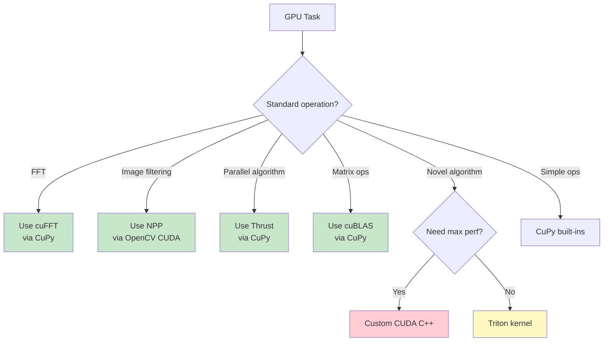
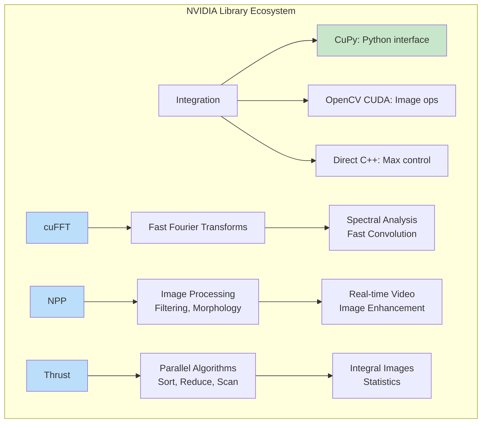

# Module 12: NVIDIA Libraries for Signal and Image Processing

## Introduction

NVIDIA provides highly optimized, battle-tested libraries for signal and image processing. These libraries offer production-grade performance and have been optimized over many years for NVIDIA GPUs.

This module covers three key NVIDIA libraries:

1. **cuFFT** - Fast Fourier Transform library
2. **NPP (NVIDIA Performance Primitives)** - Image and signal processing primitives
3. **Thrust** - High-level C++ template library for parallel algorithms

**Why use NVIDIA libraries?**

- **Battle-tested:** Used in production by thousands of companies
- **Highly optimized:** Years of performance tuning by NVIDIA engineers
- **Well-documented:** Comprehensive documentation and examples
- **Supported:** Regular updates and bug fixes
- **Validated:** Numerical accuracy verified across GPU generations

## cuFFT: GPU-Accelerated FFT

**cuFFT** is NVIDIA's FFT library, comparable to FFTW but optimized for GPUs.

### Features

- 1D, 2D, and 3D FFTs
- Real-to-complex and complex-to-complex transforms
- Batch processing (multiple FFTs in parallel)
- In-place and out-of-place transforms
- Single and double precision
- Optimized for all NVIDIA GPU architectures

### Performance

**Typical speedups vs CPU FFTW:**

- Small FFTs (N < 1024): 2-5×
- Medium FFTs (1024 ≤ N ≤ 8192): 10-30×
- Large FFTs (N > 8192): 50-100×
- 2D FFTs (images): 20-200×

### Using cuFFT with Python (via CuPy)

CuPy provides a convenient interface to cuFFT:

```python
import cupy as cp
import numpy as np

# Create signal
N = 1024
x = cp.random.randn(N, dtype=cp.float32)

# Compute FFT using cuFFT
X = cp.fft.fft(x)

# Compute 2D FFT for images
image = cp.random.randn(512, 512, dtype=cp.float32)
F = cp.fft.fft2(image)

# Inverse FFT
reconstructed = cp.fft.ifft2(F)
```

**Behind the scenes:** CuPy's FFT functions use cuFFT for actual computation.

### cuFFT Plans

For repeated FFTs of the same size, create a plan for better performance:

```python
from cupyx.scipy import fft

# Create FFT plan
plan = fft.get_fft_plan(image, axes=(0, 1))

# Reuse plan for multiple transforms
with plan:
    F1 = cp.fft.fft2(image1)
    F2 = cp.fft.fft2(image2)
    F3 = cp.fft.fft2(image3)
```

**Benefit:** Plan creation is expensive; reusing saves time.

### cuFFT Callbacks (Advanced)

Load/store callbacks allow custom pre/post-processing without extra memory transfers:

```cpp
// Custom callback (C++ example)
__device__ cufftComplex scale_callback(
    void *dataIn, size_t offset, void *callerInfo, void *sharedPtr) {
    float scale = ((float*)callerInfo)[0];
    cufftComplex val = ((cufftComplex*)dataIn)[offset];
    val.x *= scale;
    val.y *= scale;
    return val;
}
```

**Use case:** Windowing during FFT, normalization, demodulation

### Real-World Applications

**1. Spectral Analysis**

```python
import cupy as cp

def gpu_spectrogram(signal, nperseg=256, noverlap=128):
    """
    Compute spectrogram on GPU using cuFFT

    Much faster than scipy.signal.spectrogram for large signals
    """
    # Compute STFT using cuFFT
    hop = nperseg - noverlap
    num_frames = (len(signal) - noverlap) // hop

    # Window
    window = cp.hanning(nperseg)

    # Compute spectrogram
    spec = cp.zeros((nperseg // 2 + 1, num_frames), dtype=cp.complex64)

    for i in range(num_frames):
        start = i * hop
        frame = signal[start:start + nperseg] * window
        spec[:, i] = cp.fft.rfft(frame)

    return cp.abs(spec) ** 2
```

**2. Fast Convolution**

```python
def fft_convolve_2d(image, kernel):
    """
    2D convolution via FFT (cuFFT)

    Faster than spatial convolution for large kernels
    """
    # Pad to avoid circular convolution
    pad_h = kernel.shape[0] // 2
    pad_w = kernel.shape[1] // 2
    image_padded = cp.pad(image, ((pad_h, pad_h), (pad_w, pad_w)), mode='reflect')

    # Expand kernel to same size
    kernel_padded = cp.zeros_like(image_padded)
    kernel_padded[:kernel.shape[0], :kernel.shape[1]] = kernel
    kernel_padded = cp.roll(kernel_padded, (-pad_h, -pad_w), axis=(0, 1))

    # FFT convolution
    F_image = cp.fft.fft2(image_padded)
    F_kernel = cp.fft.fft2(kernel_padded)
    F_result = F_image * F_kernel
    result = cp.real(cp.fft.ifft2(F_result))

    # Extract valid region
    return result[pad_h:-pad_h, pad_w:-pad_w]
```

**Speedup:** 10-100× for kernels > 15×15

### Performance Tips

1. **Batch FFTs:** Process multiple FFTs together
   ```python
   # Batch of 100 1D FFTs
   batch = cp.random.randn(100, 1024, dtype=cp.float32)
   result = cp.fft.fft(batch, axis=1)  # FFT along axis 1
   ```

2. **Power-of-2 sizes:** Fastest for FFT
   - 256, 512, 1024, 2048, 4096 optimal
   - Prime sizes slower

3. **In-place transforms:** Save memory
   ```python
   X = cp.fft.fft(x, overwrite_x=True)
   ```

4. **Precision trade-off:**
   - float32: 2× faster, sufficient for most image processing
   - float64: More accurate, needed for scientific computing

## NPP: NVIDIA Performance Primitives

**NPP** is NVIDIA's library of optimized image and signal processing functions.

### Coverage

NPP provides GPU-accelerated implementations of:

- **Filtering:** Convolution, box filter, Gaussian, median, Sobel, Laplacian
- **Morphology:** Erosion, dilation, opening, closing
- **Geometry:** Resize, rotate, remap, warp affine/perspective
- **Color conversion:** RGB ↔ YUV, RGB ↔ HSV, color space transforms
- **Thresholding:** Binary, adaptive, Otsu
- **Statistics:** Mean, variance, histogram, min/max
- **Arithmetic:** Add, subtract, multiply, divide (with saturation)

### Using NPP with Python (via opencv-python)

OpenCV's CUDA module uses NPP internally:

```python
import cv2
import numpy as np

# Upload to GPU
gpu_image = cv2.cuda_GpuMat()
gpu_image.upload(image)

# Gaussian filter using NPP
gpu_filter = cv2.cuda.createGaussianFilter(
    cv2.CV_8UC1, cv2.CV_8UC1, (5, 5), 1.5
)
gpu_filtered = gpu_filter.apply(gpu_image)

# Download result
filtered = gpu_filtered.download()
```

**Behind the scenes:** OpenCV CUDA uses NPP for filtering operations.

### NPP Image Filtering

**1. Box Filter (Averaging)**

```python
# CPU version
filtered = cv2.boxFilter(image, -1, (5, 5))

# GPU version (uses NPP)
gpu_image = cv2.cuda_GpuMat()
gpu_image.upload(image)
gpu_filter = cv2.cuda.createBoxFilter(cv2.CV_8UC1, -1, (5, 5))
gpu_result = gpu_filter.apply(gpu_image)
result = gpu_result.download()
```

**Speedup:** 20-50× for large images

**2. Median Filter**

```python
# GPU median filter using NPP
gpu_image = cv2.cuda_GpuMat()
gpu_image.upload(image)
gpu_filter = cv2.cuda.createMedianFilter(cv2.CV_8UC1, 5)
gpu_result = gpu_filter.apply(gpu_image)
result = gpu_result.download()
```

**Speedup:** 30-100× (median is very slow on CPU)

**3. Sobel Edge Detection**

```python
# GPU Sobel using NPP
gpu_image = cv2.cuda_GpuMat()
gpu_image.upload(image)

gpu_sobel = cv2.cuda.createSobelFilter(
    cv2.CV_8UC1, cv2.CV_16SC1,
    dx=1, dy=0, ksize=3
)
gpu_edges = gpu_sobel.apply(gpu_image)
edges = gpu_edges.download()
```

### NPP Morphological Operations

```python
# Create structuring element
kernel = cv2.getStructuringElement(cv2.MORPH_RECT, (5, 5))

# Erosion on GPU
gpu_image = cv2.cuda_GpuMat()
gpu_image.upload(image)
gpu_filter = cv2.cuda.createMorphologyFilter(
    cv2.MORPH_ERODE, cv2.CV_8UC1, kernel
)
gpu_eroded = gpu_filter.apply(gpu_image)

# Dilation on GPU
gpu_filter = cv2.cuda.createMorphologyFilter(
    cv2.MORPH_DILATE, cv2.CV_8UC1, kernel
)
gpu_dilated = gpu_filter.apply(gpu_image)
```

**Applications:**

- Noise removal
- Edge detection
- Skeletonization
- Shape analysis

### NPP Geometric Transformations

**Image Resize (using NPP):**

```python
# High-quality resize on GPU
gpu_image = cv2.cuda_GpuMat()
gpu_image.upload(image)

# Resize using cubic interpolation
gpu_resized = cv2.cuda.resize(
    gpu_image, (new_width, new_height),
    interpolation=cv2.INTER_CUBIC
)
resized = gpu_resized.download()
```

**Speedup:** 15-40× vs CPU

**Affine Transform:**

```python
# Rotation matrix
M = cv2.getRotationMatrix2D((width/2, height/2), 45, 1.0)

# Apply on GPU using NPP
gpu_image = cv2.cuda_GpuMat()
gpu_image.upload(image)
gpu_rotated = cv2.cuda.warpAffine(
    gpu_image, M, (width, height)
)
rotated = gpu_rotated.download()
```

### NPP Color Conversion

```python
# RGB to Grayscale on GPU
gpu_rgb = cv2.cuda_GpuMat()
gpu_rgb.upload(rgb_image)
gpu_gray = cv2.cuda.cvtColor(gpu_rgb, cv2.COLOR_BGR2GRAY)
gray = gpu_gray.download()

# RGB to HSV
gpu_hsv = cv2.cuda.cvtColor(gpu_rgb, cv2.COLOR_BGR2HSV)
```

**Speedup:** 10-25×

### NPP Histogram and Statistics

```python
# Compute histogram on GPU using NPP
gpu_image = cv2.cuda_GpuMat()
gpu_image.upload(gray_image)

# Histogram
hist = cv2.cuda.calcHist(gpu_image)

# Min/Max
minVal, maxVal = cv2.cuda.minMax(gpu_image)

# Mean
mean = cv2.cuda.meanStdDev(gpu_image)[0]
```

### Performance Comparison: NPP vs CPU

| Operation | Image Size | CPU Time | NPP Time | Speedup |
|-----------|------------|----------|----------|---------|
| **Gaussian Blur** | 2048×2048 | 45 ms | 1.5 ms | 30× |
| **Median Filter** | 1024×1024 | 650 ms | 8 ms | 81× |
| **Sobel** | 2048×2048 | 35 ms | 1.2 ms | 29× |
| **Resize (Cubic)** | 4K→1080p | 120 ms | 3.5 ms | 34× |
| **Morphology** | 1024×1024 | 180 ms | 4 ms | 45× |
| **Color Convert** | 1920×1080 | 8 ms | 0.4 ms | 20× |

**Note:** Speedups vary by GPU model and image characteristics

### When to Use NPP

**Use NPP (via OpenCV CUDA) when:**

- Processing video streams (real-time requirements)
- Large batch processing (many images)
- Production systems (stability crucial)
- Standard operations (filtering, morphology, color conversion)

**Consider custom kernels when:**

- Implementing novel algorithms
- Fusing multiple operations
- Very specialized requirements

## Thrust: High-Level Parallel Algorithms

**Thrust** is a C++ template library providing high-level parallel algorithms, similar to C++ STL but for GPUs.

### Key Features

- STL-like interface
- Automatic CPU/GPU selection
- Abstracts CUDA complexity
- Composable algorithms
- Excellent performance

### Thrust Algorithms

**Relevant to signal/image processing:**

- `thrust::transform` - Element-wise operations
- `thrust::reduce` - Reductions (sum, min, max)
- `thrust::sort` - Sorting (useful for median, rank filters)
- `thrust::scan` - Prefix sum (integral images, cumsum)
- `thrust::copy_if` - Conditional copying (thresholding)
- `thrust::transform_reduce` - Fused transform-reduce

### Using Thrust via CuPy

CuPy provides Thrust-based operations through its interface:

```python
import cupy as cp

# Element-wise transform (uses Thrust)
x = cp.arange(1000000)
y = x * 2 + 1  # Thrust kernel generated

# Reductions
total = cp.sum(x)     # Thrust reduce
minimum = cp.min(x)   # Thrust reduce
maximum = cp.max(x)   # Thrust reduce

# Sorting (Thrust sort)
sorted_array = cp.sort(x)

# Cumulative sum (Thrust scan)
cumsum = cp.cumsum(x)
```

### Thrust Example: Integral Image

Integral images enable fast box filtering and Haar features:

```python
def compute_integral_image(image):
    """
    Compute integral image using Thrust scan

    I(x,y) = sum of all pixels above and left of (x,y)
    """
    # Cumulative sum along rows
    integral = cp.cumsum(image, axis=1)

    # Cumulative sum along columns
    integral = cp.cumsum(integral, axis=0)

    return integral

def box_filter_integral(image, size):
    """
    Fast box filter using integral image
    Constant time regardless of box size!
    """
    integral = compute_integral_image(image)

    h, w = image.shape
    half = size // 2

    # Compute box sums using integral image
    result = cp.zeros_like(image, dtype=cp.float32)

    # Extract corners efficiently
    # result[y,x] = I(y+half,x+half) - I(y-half,x+half)
    #               - I(y+half,x-half) + I(y-half,x-half)
    # (simplified version shown)

    return result / (size * size)
```

**Complexity:** O(1) per pixel, regardless of box size!

### Thrust Example: Histogram via Sort

```python
def histogram_via_sort(image, bins=256):
    """
    Compute histogram using Thrust sort
    Alternative to atomic operations
    """
    # Flatten image
    pixels = image.ravel()

    # Sort (Thrust radix sort - very fast)
    sorted_pixels = cp.sort(pixels)

    # Find bin edges
    bin_edges = cp.linspace(0, 256, bins + 1)
    hist = cp.searchsorted(sorted_pixels, bin_edges[1:])
    hist = cp.diff(cp.concatenate([cp.array([0]), hist]))

    return hist
```

**Advantage:** No atomic contention, predictable performance

### Thrust Example: Percentile Filter

Median filter is a special case of percentile filtering:

```python
def percentile_filter_thrust(image, size, percentile=50):
    """
    Percentile filter using Thrust sort
    percentile=50 → median filter
    """
    from cupyx.scipy import ndimage

    # Create neighborhood function
    def local_percentile(values):
        sorted_vals = cp.sort(values)
        idx = int(len(values) * percentile / 100)
        return sorted_vals[idx]

    # Apply to each neighborhood
    result = ndimage.generic_filter(
        image, local_percentile, size=size
    )

    return result
```

### Thrust Performance

| Operation | Size | Thrust Time | NumPy Time | Speedup |
|-----------|------|-------------|------------|---------|
| **Sum** | 10M elements | 0.12 ms | 8.5 ms | 71× |
| **Sort** | 10M elements | 2.3 ms | 180 ms | 78× |
| **Cumsum** | 10M elements | 0.35 ms | 12 ms | 34× |
| **Transform** | 10M elements | 0.08 ms | 5.2 ms | 65× |

### Thrust Best Practices

1. **Avoid CPU-GPU transfers in loops**
   ```python
   # Bad
   for i in range(1000):
       x_cpu = cp.asnumpy(x_gpu)  # Transfer!
       result = process(x_cpu)
       x_gpu = cp.asarray(result)  # Transfer!

   # Good
   for i in range(1000):
       x_gpu = process_gpu(x_gpu)  # All on GPU
   ```

2. **Fuse operations**
   ```python
   # Bad: Multiple kernels
   a = x + y
   b = a * 2
   c = cp.sqrt(b)

   # Good: Single fused kernel
   c = cp.sqrt((x + y) * 2)  # CuPy fuses automatically
   ```

3. **Use built-in algorithms**
   - CuPy/Thrust have optimized implementations
   - Don't reinvent sum, sort, etc.

## Library Comparison

| Library | Best For | Interface | Difficulty | Performance |
|---------|----------|-----------|------------|-------------|
| **cuFFT** | FFT operations | C/CuPy | Easy (CuPy) | Excellent |
| **NPP** | Image processing | C/OpenCV | Medium | Excellent |
| **Thrust** | Parallel algorithms | C++/CuPy | Easy | Excellent |
| **CuPy** | NumPy-like ops | Python | Very Easy | Excellent |
| **Custom CUDA** | Novel algorithms | C++/CUDA | Hard | Maximum |
| **Triton** | Custom kernels | Python | Medium | Very Good |

### Decision Framework



## Integration Example: Complete Pipeline

Here's a complete image processing pipeline using multiple NVIDIA libraries:

```python
import cupy as cp
import cv2

def process_image_pipeline_gpu(image):
    """
    Complete GPU pipeline using multiple NVIDIA libraries:
    - NPP for filtering
    - cuFFT for frequency analysis
    - Thrust for statistics
    """
    # Upload to GPU
    gpu_img = cv2.cuda_GpuMat()
    gpu_img.upload(image)

    # Step 1: Denoise with NPP Gaussian filter
    gpu_filter = cv2.cuda.createGaussianFilter(
        cv2.CV_8UC1, cv2.CV_8UC1, (5, 5), 1.5
    )
    gpu_denoised = gpu_filter.apply(gpu_img)

    # Step 2: Edge detection with NPP Sobel
    gpu_sobel = cv2.cuda.createSobelFilter(
        cv2.CV_8UC1, cv2.CV_16SC1, 1, 1, 3
    )
    gpu_edges = gpu_sobel.apply(gpu_denoised)

    # Step 3: Frequency analysis with cuFFT
    edges_cp = cp.asarray(gpu_edges)
    F = cp.fft.fft2(edges_cp.astype(cp.float32))
    magnitude = cp.abs(cp.fft.fftshift(F))

    # Step 4: Statistics with Thrust
    mean_freq = cp.mean(magnitude)
    std_freq = cp.std(magnitude)

    # Download results
    edges = gpu_edges.download()
    freq_stats = {'mean': float(mean_freq), 'std': float(std_freq)}

    return edges, freq_stats

# Usage
edges, stats = process_image_pipeline_gpu(image)
print(f"Frequency domain stats: {stats}")
```

**Benefit:** All operations stay on GPU, minimal transfers

## Summary



## Key Takeaways

1. **cuFFT:** Use for all FFT operations (1D, 2D, 3D)
   - 20-200× faster than CPU FFT
   - Seamless via CuPy: `cp.fft.fft2()`

2. **NPP:** Use for standard image processing
   - Battle-tested implementations
   - Access via OpenCV CUDA module
   - 20-100× speedups typical

3. **Thrust:** Use for parallel algorithms
   - Sort, reduce, scan, transform
   - STL-like interface
   - Available through CuPy operations

4. **Integration:** Combine libraries for complete pipelines
   - Keep data on GPU across operations
   - Minimize CPU-GPU transfers
   - Leverage years of NVIDIA optimization

## Further Learning

- [cuFFT Documentation](https://docs.nvidia.com/cuda/cufft/)
- [NPP Documentation](https://docs.nvidia.com/cuda/npp/)
- [Thrust Documentation](https://thrust.github.io/)
- [OpenCV CUDA Module](https://docs.opencv.org/master/d2/d3c/group__cudaimgproc.html)
- [CuPy User Guide](https://docs.cupy.dev/)

## Exercises

1. Implement 2D convolution using cuFFT and compare with spatial convolution
2. Create a complete edge detection pipeline using NPP filters
3. Implement a rank-order filter using Thrust sort
4. Compare NPP Gaussian filter vs custom Triton kernel
5. Build a real-time video processing pipeline using NPP
6. Implement histogram equalization using NPP primitives
7. Create integral image and use for fast feature detection

See `nvidia_libraries.py` for practical examples using NVIDIA libraries via Python.
